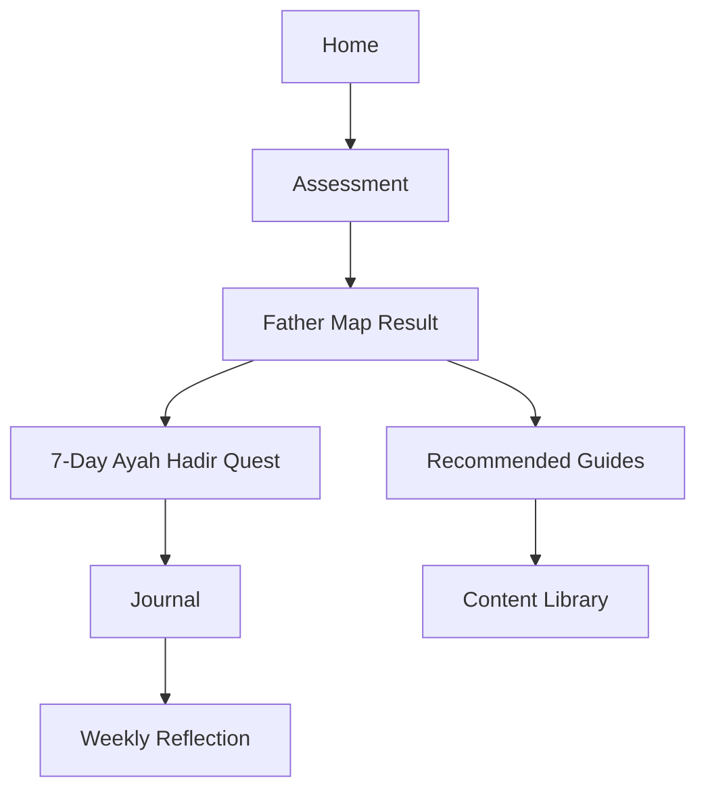

# 01 — Product Blueprint

## Nama

**GoodFather**

## One-liner

**Fatherhood OS untuk ayah Muslim modern: panduan menjadi ayah yang hadir, sadar, penyayang, tegas, dan siap mendidik anak di era AI tanpa kehilangan arah akhirat.**

## Why Now

Banyak ayah modern mengalami tekanan ganda:

- tuntutan nafkah dan kerja makin tinggi,
- dunia anak berubah cepat karena internet, AI, gaming, konten pendek, dan global culture,
- banyak ayah sadar pentingnya parenting tapi tidak tahu mulai dari mana,
- konten parenting sering terlalu ibu-centric, terlalu klinis, atau terlalu menggurui,
- konten islami kadang kuat secara nasihat, tapi belum terhubung ke fase tumbuh-kembang anak.

GoodFather hadir sebagai jembatan: **iman + psikologi perkembangan + pendidikan karakter + literasi era AI + daily habit ayah.**

## Problem Statement

Ayah ingin menjadi lebih baik, tetapi sering tidak punya sistem harian untuk:

1. memahami fase anak,
2. menyesuaikan cara mendidik dengan usia dan gender anak,
3. membangun adab dan iman tanpa paksaan kaku,
4. menjaga emosi saat anak sulit,
5. mengatur screen time dan AI exposure,
6. memperbaiki relasi setelah marah,
7. tahu kapan perlu bantuan profesional.

## Target User

### Primary

Ayah Muslim usia 25–45 tahun dengan anak usia 0–12 tahun, tech-savvy, kerja padat, punya keresahan personal ingin mendidik anak dengan benar.

### Secondary

- calon ayah,
- ayah dengan anak remaja,
- ibu yang ingin mengajak suami terlibat,
- komunitas parenting/kajian keluarga,
- sekolah Islam/PAUD/TK/SD Islam.

## Value Proposition

GoodFather membantu ayah menjawab:

- “Anak gue sedang di fase apa?”
- “Sebagai ayah, prioritas gue minggu ini apa?”
- “Gue harus ngomong apa saat anak tantrum?”
- “Gimana cara ngajarin shalat/adab tanpa bikin anak trauma?”
- “Screen time anak aman atau udah kebablasan?”
- “Apa misi kecil hari ini biar gue jadi ayah yang lebih hadir?”

## Brand Personality

- **Brotherly:** seperti teman sesama ayah yang paham capeknya hidup.
- **Grounded:** berbasis referensi valid, tidak asal quotes.
- **Warm Islamic:** menenangkan, rahmah-first, bukan galak-first.
- **Fun:** pakai quest, map, badge, dan humor bapak-bapak secukupnya.
- **Actionable:** selalu berakhir dengan langkah kecil.

## Product Principles

1. **Connection before correction**  
   Koreksi anak lebih mudah saat koneksi ayah-anak sehat.

2. **Rahmah before rage**  
   Tegas boleh, tapi kasar bukan identitas ayah Muslim.

3. **Phase-aware parenting**  
   Cara mendidik anak 3 tahun beda dengan 10 tahun.

4. **Adab + skill**  
   Anak butuh akhlak, tapi juga butuh critical thinking, komunikasi, dan literasi digital.

5. **Small daily wins**  
   Ayah tidak berubah lewat motivasi besar, tapi lewat misi kecil konsisten.

6. **No diagnosis**  
   Assessment hanya edukatif, bukan diagnosis psikologi/medis.

7. **Reviewed content**  
   Konten syariah idealnya direview ustadz/ahli fikih keluarga. Konten psikologi idealnya direview psikolog anak.

## Core Experience

## MVP Scope

### Must Have

- Landing page
- Assessment
- Personalized Father Map
- Age-based guide
- Boy/girl guide
- Daily mission
- Journal template
- Reference-backed article library
- Safety/disclaimer page

### Should Have

- Bookmark
- Multi-child profile
- Progress streak
- Printable checklist
- Shareable Father Map summary

### Could Have

- AI assistant with RAG from approved content
- Community challenge
- Newsletter
- Partner directory for psychologist/ustadz

## Main Conversion CTA

- **Mulai Peta Ayah**
- **Ambil Assessment 3 Menit**
- **Mulai 7 Hari Ayah Hadir**

