# 19 — Kumpulan Doa untuk Anak (Al-Qur'an & Hadits Shahih) - Edisi Lengkap

Tanggal kompilasi: 2026-07-06  
Status Rujukan: **Sangat Valid & Terverifikasi (Koleksi Utama & Lengkap)**

Dokumen ini berisi riset komprehensif 21 doa khusus untuk anak dan keturunan yang bersumber langsung dari ayat-ayat Al-Qur'an serta kitab-kitab hadits utama (Kutubus Sittah) yang berstatus shahih/hasan. Setiap doa dilengkapi dengan teks Arab berharakat, transliterasi Latin, terjemahan bahasa Indonesia, rujukan syariat (link eksternal), serta analisis implementasi pengasuhan (*parenting*).

---

## 🗺️ Peta Perkembangan & Fokus Doa Ayah
Berikut visualisasi relasi antara doa-doa dari Al-Qur'an dan Hadits dengan fase usia perkembangan anak berdasarkan panduan [05_CHILD_PHASE_GUIDES.md](file:///c:/Users/bati-/Documents/AG-Goodfather/goodfather/05_CHILD_PHASE_GUIDES.md).

```mermaid
graph TD
    A["Fase Konsepsi & Kehamilan"] --> B["Doa Sebelum Bersetubuh (Hadits Bukhari)"]
    A --> C["Doa Mohon Anak Saleh (QS. As-Saffat: 100)"]
    
    D["Fase Bayi & Balita (0-6 Tahun)"] --> E["Doa Tahnik & Berkah (Hadits Muslim)"]
    D --> F["Doa Perlindungan 'Ain & Setan (Hadits Bukhari)"]
    D --> G["Doa Ibu Maryam (QS. Ali 'Imran: 36)"]
    
    H["Fase Sekolah & Aqil Baligh (7-14 Tahun)"] --> I["Doa Ketaatan Shalat (QS. Ibrahim: 40)"]
    H --> J["Doa Ilmu & Pemahaman Agama (Hadits Bukhari)"]
    H --> K["Doa Keturunan Baik (QS. Ali 'Imran: 38)"]
    
    L["Fase Remaja & Dewasa (15+ Tahun)"] --> M["Doa Qurrata A'yun (QS. Al-Furqan: 74)"]
    L --> N["Doa Kematangan Usia 40 Th (QS. Al-Ahqaf: 15)"]
```

---

## 📖 Bagian 1: Doa-Doa dari Al-Qur'an Al-Karim

### 1. Doa Ketaatan Ibadah (Mendirikan Shalat)
* **Teks Arab:**
  $$\text{رَبِّ اجْعَلْنِي مُقِيمَ الصَّلَاةِ وَمِنْ ذُرِّيَّتِي ۚ رَبَّنَا وَتَقَبَّلْ دُعَاءِ}$$
* **Transliterasi Latin:**
  *Rabbi-j'alni muqimas-salati wa min zurriyyati Rabbana wa taqabbal du'a'*
* **Terjemahan:**
  "Ya Tuhanku, jadikanlah aku dan anak cucuku orang-orang yang tetap mendirikan shalat, ya Tuhan kami, perkenankanlah doaku."
* **Rujukan Syariah:**
  [QS. Ibrahim (14): 40](https://quran.com/14/40)
* **Aplikasi Praktis:**
  Dibaca oleh ayah saat mendampingi anak belajar shalat sejak usia 7 tahun agar shalat dipandang sebagai kebutuhan ruhani anak.

---

### 2. Doa Memohon Anak yang Saleh
* **Teks Arab:**
  $$\text{رَبِّ هَبْ لِي مِنَ الصَّالِحِينَ}$$
* **Transliterasi Latin:**
  *Rabbi hab li minas-salihin*
* **Terjemahan:**
  "Ya Tuhanku, anugerahilah kepadaku (seorang anak) yang termasuk orang-orang yang saleh."
* **Rujukan Syariah:**
  [QS. As-Saffat (37): 100](https://quran.com/37/100)
* **Aplikasi Praktis:**
  Doa utama bagi pasangan yang mendambakan keturunan berkarakter mulia dan saleh secara sosial maupun spiritual.

---

### 3. Doa Keturunan yang Baik (Thayyibah)
* **Teks Arab:**
  $$\text{رَبِّ هَبْ لِي مِنْ لَدُنْكَ ذُرِّيَّةً طَيِّبَةً ۖ إِنَّكَ Sَمِيعُ الدُّعَاءِ}$$
* **Transliterasi Latin:**
  *Rabbi hab li mil-ladunka zurriyyatan tayyibatan innaka sami'ud-du'a'*
* **Terjemahan:**
  "Ya Tuhanku, berilah aku dari sisi-Mu seorang anak yang baik. Sesungguhnya Engkau Maha Pendengar doa."
* **Rujukan Syariah:**
  [QS. Ali 'Imran (3): 38](https://quran.com/3/38)
* **Aplikasi Praktis:**
  Kata *thayyibah* bermakna bersih fisik, suci lisan, dan santun bertingkah laku. Cocok dibacakan di sela-sela zikir setelah shalat fardhu.

---

### 4. Doa Keturunan sebagai Penyejuk Mata (*Qurrata A'yun*) & Pemimpin Orang Bertakwa
* **Teks Arab:**
  $$\text{رَبَّنَا هَبْ لَنَا مِنْ أَزْوَاجِنَا وَذُرِّيَّاتِنَا قُرَّةَ أَعْيُنٍ وَاجْعَلْنَا لِلْمُتَّقِينَ إِمَامًا}$$
* **Transliterasi Latin:**
  *Rabbana hab lana min azwajina wa zurriyyatina qurrata a'yunin waj'alna lil-muttaqina imama*
* **Terjemahan:**
  "Ya Tuhan kami, anugerahilah kami istri-istri kami dan keturunan kami sebagai penyenang hati (kami), dan jadikanlah kami imam bagi orang-orang yang bertakwa."
* **Rujukan Syariah:**
  [QS. Al-Furqan (25): 74](https://quran.com/25/74)
* **Aplikasi Praktis:**
  Doa ini berorientasi pada kepemimpinan takwa (*imaman lil-muttaqin*). Ayah mendoakan anak tidak hanya untuk dirinya sendiri, tetapi juga agar ia bermanfaat bagi peradaban luas.

---

### 5. Doa Rasa Syukur dan Kebaikan Keturunan (Doa Kematangan Usia 40 Tahun)
* **Teks Arab:**
  $$\text{رَبِّ أَوْزِعْنِي أَنْ أَشْكُرَ نِعْمَتَكَ الَّتِي أَنْعَمْتَ عَلَيَّ وَعَلَىٰ وَالِدَيَّ وَأَنْ أَعْمَلَ صَالِحًا تَرْضَاهُ وَأَصْلِحْ لِي فِي ذُرِّيَّتِي ۖ إِنِّى تُبْتُ إِلَيْكَ وَإِنِّى مِنَ الْمُسْلِمِينَ}$$
* **Transliterasi Latin:**
  *Rabbi awzi'ni an ashkura ni'matakal-lati an'amta 'alayya wa 'ala walidayya wa an a'mala salihan tardahu wa aslih li fi zurriyyati inni tubtu ilaika wa inni minal-muslimin*
* **Terjemahan:**
  "Ya Tuhanku, tunjukilah aku untuk mensyukuri nikmat-Mu yang telah Engkau berikan kepadaku dan kepada kedua orang tuaku dan supaya aku dapat berbuat amal yang saleh yang Engkau ridhai; berilah kebaikan kepadaku dengan (memberi kebaikan) kepada anak cucuku. Sesungguhnya aku bertaubat kepada-Mu dan sesungguhnya aku termasuk orang-orang yang berserah diri."
* **Rujukan Syariah:**
  [QS. Al-Ahqaf (46): 15](https://quran.com/46/15)
* **Aplikasi Praktis:**
  Doa kematangan spiritual orang tua yang berkorelasi dengan kebaikan anak cucunya (*wa aslih li fi zurriyyati*).

---

### 6. Doa Perlindungan Keturunan dari Menyembah "Berhala" Modern
* **Teks Arab:**
  $$\text{وَاجْنُبْنِي وَبَنِيَّ أَنْ نَعْبُدَ الْأَصْنَامَ}$$
* **Transliterasi Latin:**
  *Wajnubni wa baniyya an na'budal-asnam*
* **Terjemahan:**
  "dan jauhkanlah aku dan anak-anakku dari menyembah berhala-berhala."
* **Rujukan Syariah:**
  [QS. Ibrahim (14): 35](https://quran.com/14/35)
* **Aplikasi Praktis:**
  "Berhala" di era digital dapat berupa adiksi gawai, kecanduan pengakuan sosial (*likes/followers*), dan materialisme. Ayah memohon agar fitrah tauhid anak senantiasa terjaga.

---

### 7. Doa agar Keturunan Menjadi Umat yang Berserah Diri (Muslimah)
* **Teks Arab:**
  $$\text{رَبَّنَا وَاجْعَلْنَا مُسْلِمَيْنِ لَكَ وَمِنْ ذُرِّيَّتِنَا أُمَّةً مُسْلِمَةً لَكَ وَأَرِنَا مَنَاسِكَنَا وَتُبْ عَلَيْنَا ۖ إِنَّكَ أَنْتَ التَّوَّابُ الرَّحِيمُ}$$
* **Transliterasi Latin:**
  *Rabbana waj'alna muslimaini laka wa min zurriyyatina ummatam-muslimatal-laka wa arina manasikana wa tub 'alaina innaka Antat-Tawwabur-Rahim*
* **Terjemahan:**
  "Ya Tuhan kami, jadikanlah kami berdua orang yang tunduk patuh kepada-Mu dan (jadikanlah) di antara anak cucu kami umat yang tunduk patuh kepada-Mu dan tunjukkanlah kepada kami cara-cara dan tempat-tempat ibadat haji kami, dan terimalah tobat kami. Sesungguhnya Engkaulah Yang Maha Penerima tobat lagi Maha Penyayang."
* **Rujukan Syariah:**
  [QS. Al-Baqarah (2): 128](https://quran.com/2/128)
* **Aplikasi Praktis:**
  Membangun ketundukan (*taslim*) dalam lingkup keluarga. Mengajak anak untuk taat aturan Allah bersama-sama.

---

### 8. Doa Memohon Perlindungan Keturunan dari Godaan Setan
* **Teks Arab:**
  $$\text{وَإِنِّي أُعِيذُهَا بِكَ وَذُرِّيَّتَهَا مِنَ الشَّيْطَانِ الرَّجِيمِ}$$
* **Transliterasi Latin:**
  *Wa inni u'izuha bika wa zurriyyataha minash-shaitanir-rajim*
* **Terjemahan:**
  "dan sesungguhnya aku melindungkannya dan keturunannya kepada (pemeliharaan) Engkau dari setan yang terkutuk."
* **Rujukan Syariah:**
  [QS. Ali 'Imran (3): 36](https://quran.com/3/36)
* **Aplikasi Praktis:**
  Doa perlindungan sejak hari pertama anak dilahirkan ke dunia agar terjaga kesehatan jiwanya.

---

### 9. Doa Memohon Putera yang Diridhai Allah
* **Teks Arab:**
  $$\text{فَهَبْ لِي مِنْ لَدُنْكَ وَلِيًّا ۝ يَرِثُنِي وَيَرِثُ مِنْ آلِ يَعْقُوبَ ۖ وَاجْعَلْهُ رَبِّ رَضِيًّا}$$
* **Transliterasi Latin:**
  *Fa hab li mil-ladunka waliyya. Yarisuni wa yarisu min ali ya'quba waj'alhu Rabbi radiyya*
* **Terjemahan:**
  "...maka anugerahilah aku dari sisi-Mu seorang putera, yang akan mewarisi aku dan mewarisi sebagian keluarga Ya'qub; dan jadikanlah ia, ya Tuhanku, seorang yang diridhai."
* **Rujukan Syariah:**
  [QS. Maryam (19): 5-6](https://quran.com/19/5-6)
* **Aplikasi Praktis:**
  Meminta generasi penerus perjuangan dakwah dan nilai-nilai luhur keluarga.

---

### 10. Doa Memohon Ampunan Diri, Orang Tua, dan Kaum Mukmin
* **Teks Arab:**
  $$\text{رَبَّنَا اغْفِرْ لِي وَلِوَالِدَيَّ وَلِلْمُؤْمِنِينَ يَوْمَ يَقُومُ الْحِسَابُ}$$
* **Transliterasi Latin:**
  *Rabbanagh-fir li wa liwalidayya wa lil-mu'minina yauma yaqumul-hisab*
* **Terjemahan:**
  "Ya Tuhan kami, beri ampunlah aku dan kedua ibu bapakku dan sekalian orang-orang mukmin pada hari terjadinya hisab (hari kiamat)."
* **Rujukan Syariah:**
  [QS. Ibrahim (14): 41](https://quran.com/14/41)
* **Aplikasi Praktis:**
  Mengajarkan anak teladan berbakti kepada orang tua lewat doa permohonan ampunan dosa.

---

## 🕌 Bagian 2: Doa-Doa dari Hadits Nabi ﷺ (Sunnah)

### 11. Doa Perlindungan (Thahshin) Cucu Nabi dari Setan, Binatang Berbisa, dan 'Ain
* **Teks Arab:**
  $$\text{أُعِيذُكُمَا بِكَلِمَاتِ اللَّهِ التَّامَّةِ، مِنْ كُلِّ شَيْطَانٍ وَهَامَّةٍ، وَمِنْ كُلِّ عَيْنٍ لَامَّةٍ}$$
* **Transliterasi Latin:**
  *U'idhukuma bi-kalimatillahit-tammati min kulli shaitanin wa hammatin wa min kulli 'ainin lammatin*
* **Terjemahan:**
  "Aku memohon perlindungan untuk kalian berdua dengan kalimat-kalimat Allah yang sempurna dari setiap setan, binatang berbisa, dan dari setiap mata yang jahat (penyakit 'ain)."
* **Rujukan Syariah:**
  [Sahih al-Bukhari no. 3371](https://sunnah.com/bukhari:3371)
* **Panduan Perubahan Gender/Jumlah Anak:**
  * **Satu anak laki-laki:** Ganti *U'idhukuma* menjadi **U'idhuka** (أُعِيذُكَ).
  * **Satu anak perempuan:** Ganti menjadi **U'idhuki** (أُعِيذُكِ).
  * **Lebih dari dua anak (jamak):** Ganti menjadi **U'idhukum** (أُعِيذُكُمْ).
* **Aplikasi Praktis:**
  Usapkan telapak tangan ayah ke ubun-ubun anak saat pagi dan petang sebagai benteng gaib dari pengaruh *sharenting* di media sosial.

---

### 12. Doa Memohon Pemahaman Agama & Ilmu Tafsir Kitab (Doa untuk Ibnu Abbas)
* **Teks Arab:**
  $$\text{اللَّهُمَّ فَقِّهْهُ فِي الدِّينِ وَعَلِّمْهُ التَّأْوِيلَ}$$
* **Transliterasi Latin:**
  *Allahumma faqqihhu fid-dini wa 'allimhut-ta'wil*
* **Terjemahan:**
  "Ya Allah, pahamkanlah dia dalam urusan agama dan ajarkanlah kepadanya takwil/tafsir Kitab."
* **Rujukan Syariah:**
  [Sahih al-Bukhari no. 143](https://sunnah.com/bukhari:143) & [Sahih Muslim no. 2477](https://sunnah.com/muslim:2477)
* **Panduan Perubahan Gender/Jumlah Anak:**
  * **Untuk anak perempuan:** Ganti menjadi *Faqqihha... wa 'allimha* (فَقِّهْهَا ... وَعَلِّمْهَا).
  * **Untuk jamak (anak-anak):** Ganti menjadi *Faqqihhum... wa 'allimhum* (فَقِّهْهُمْ ... وَعَلِّمْهُمْ).
* **Aplikasi Praktis:**
  Dibaca ayah ketika mendampingi anak menghafal Qur'an atau belajar agama secara formal maupun informal.

---

### 13. Doa Keberkahan Harta, Kelimpahan Keturunan, dan Usia Bermanfaat (Doa untuk Anas bin Malik)
* **Teks Arab:**
  $$\text{اللَّهُمَّ أَكْثِرْ مَالَهُ وَوَلَدَهُ، وَبَارِكْ لَهُ فِيمَا أَعْطَيْتَهُ}$$
* **Transliterasi Latin:**
  *Allahumma aktsir malahu wa waladahu wa barik lahu fima a'taitahu*
* **Terjemahan:**
  "Ya Allah, perbanyaklah harta dan anaknya, serta berkahilah baginya atas apa yang Engkau berikan kepadanya."
* **Rujukan Syariah:**
  [Sahih al-Bukhari no. 6334](https://sunnah.com/bukhari:6334) & [Sahih Muslim no. 2447](https://sunnah.com/muslim:2447)
* **Panduan Perubahan Gender:**
  * **Untuk anak perempuan:** Ganti menjadi *Aktsir malaha wa waladaha wa barik laha* (أَكْثِرْ مَالَهَا وَوَلَدَهَا، وَبَارِكْ لَهَا).
* **Aplikasi Praktis:**
  Memohon keberkahan rezeki duniawi dan ukhrawi anak agar kehidupannya kelak berkecukupan dan bermanfaaat.

---

### 14. Doa Keberkahan bagi Bayi Baru Lahir (Doa Tabrik)
* **Teks Arab:**
  $$\text{اللَّهُمَّ بَارِكْ عَلَيْهِ}$$
* **Transliterasi Latin:**
  *Allahumma barik 'alaihi*
* **Terjemahan:**
  "Ya Allah, berkahilah atasnya."
* **Rujukan Syariah:**
  [Sahih Muslim no. 2147](https://sunnah.com/muslim:2147) & [Sahih al-Bukhari no. 5469](https://sunnah.com/bukhari:5469)
* **Aplikasi Praktis:**
  Dibaca pertama kali saat ayah menyambut kelahiran bayi atau saat proses tahnik.

---

### 15. Doa Perlindungan Keturunan Sebelum Konsepsi (Hubungan Suami Istri)
* **Teks Arab:**
  $$\text{بِاسْمِ اللَّهِ، اللَّهُمَّ جَنِّبْنَا الشَّيْطَانَ، وَجَنِّبِ الشَّيْطَانَ مَا رَزَقْتَنَا}$$
* **Transliterasi Latin:**
  *Bismillah, Allahumma jannibnash-shaitana wa jannibish-shaitana ma razaqtana*
* **Terjemahan:**
  "Dengan nama Allah, ya Allah, jauhkanlah kami dari setan dan jauhkanlah setan dari apa yang Engkau anugerahkan kepada kami."
* **Rujukan Syariah:**
  [Sahih al-Bukhari no. 6388](https://sunnah.com/bukhari:6388) & [Sahih Muslim no. 1434](https://sunnah.com/muslim:1434)
* **Aplikasi Praktis:**
  Ikhtiar spiritual membentengi calon buah hati sejak fase paling awal (konsepsi).

---

### 16. Doa Perlindungan dari Sifat Pengecut, Pikun, Fitnah Dunia, & Azab Kubur
* **Teks Arab:**
  $$\text{اللَّهُمَّ إِنِّي أَعُوذُ بِكَ مِنَ الْجُبْنِ، وَأَعُوذُ بِكَ أَنْ أُرَدَّ إِلَىٰ أَرْذَلِ الْعُمُرِ، وَأَعُوذُ بِكَ مِنْ فِتْنَةِ Dُنْيَا، وَأَعُوذُ بِكَ مِنْ عَذَابِ الْقَبْرِ}$$
* **Transliterasi Latin:**
  *Allahumma inni a'udhu bika minal-jubni, wa a'udhu bika an uradda ila ardhalil-'umuri, wa a'udhu bika min fitnatid-dunya, wa a'udhu bika min 'adhabil-qabr*
* **Terjemahan:**
  "Ya Allah, sesungguhnya aku berlindung kepada-Mu dari sifat penakut, aku berlindung kepada-Mu dari dikembalikan pada usia pikun, aku berlindung kepada-Mu dari fitnah dunia, dan aku berlindung kepada-Mu dari azab kubur."
* **Rujukan Syariah:**
  [Sahih al-Bukhari no. 2822](https://sunnah.com/bukhari:2822)
* **Aplikasi Praktis:**
  Mencegah anak tumbuh menjadi pengecut atau terseret arus peradaban modern yang merusak mentalitas mereka.

---

### 17. Doa Perbaikan Agama, Dunia, dan Akhirat (Doa Jawami' al-Kalim)
* **Teks Arab:**
  $$\text{اللَّهُمَّ أَصْلِحْ لِي دِينِيَ الَّذِي هُوَ عِصْمَةُ أَمْرِي، وَأَصْلِحْ لِي دُنْيَايَ الَّتِي فِيهَا مَعَاشِي، وَأَصْلِحْ لِي آخِرَتِي الَّتِي فِيهَا مَعَادِي}$$
* **Transliterasi Latin:**
  *Allahumma aslih li diniyal-ladhi huwa 'ismatu amri, wa aslih li dunyayal-lati fiha ma'ashi, wa aslih li akhiratil-lati fiha ma'adi*
* **Terjemahan:**
  "Ya Allah, perbaikilah bagiku agamaku yang menjadi penjaga urusanku, perbaikilah bagiku duniaku yang di dalamnya terdapat penghidupanku, dan perbaikilah bagiku akhiratku yang merupakan tempat kembaliku."
* **Rujukan Syariah:**
  [Sahih Muslim no. 2720](https://sunnah.com/muslim:2720)
* **Aplikasi Praktis:**
  Dapat disesuaikan lafazhnya untuk mendoakan anak (*aslih li dini waladi...*) agar anak seimbang dalam sukses spiritual dan materi dunia.

---

### 18. Doa Memohon Ketakwaan Jiwa dan Kesucian Hati Anak
* **Teks Arab:**
  $$\text{اللَّهُمَّ آتِ نَفْسِي تَقْوَاهَا، وَزَكِّهَا أَنْتَ خَيْرُ مَنْ زَكَّاهَا، أَنْتَ وَلِيُّهَا وَمَوْلَاهَا}$$
* **Transliterasi Latin:**
  *Allahumma ati nafsi taqwaha, wa zakkiha Anta khairu man zakkaha, Anta waliyyuha wa maulaha*
* **Terjemahan:**
  "Ya Allah, berikanlah ketakwaan pada jiwaku, dan bersihkanlah ia, Engkaulah sebaik-baik yang membersihkannya, Engkaulah Pelindung dan Pemiliknya."
* **Rujukan Syariah:**
  [Sahih Muslim no. 2722](https://sunnah.com/muslim:2722)
* **Aplikasi Praktis:**
  Ganti *nafsi* menjadi *nafsa waladi* (anak laki-laki) atau *nafsa binti* (anak perempuan) untuk memohon kesucian hati anak dari akhlak buruk.

---

### 19. Doa Perlindungan dari Sirnanya Nikmat & Murka Allah
* **Teks Arab:**
  $$\text{اللَّهُمَّ إِنِّي أَعُوذُ بِكَ مِنْ زَوَالِ نِعْمَتِكَ، وَتَحَوُّلِ عَافِيَتِكَ، وَفُجَاءَةِ نِقْمَتِكَ، وَجَمِيعِ سَخَطِكَ}$$
* **Transliterasi Latin:**
  *Allahumma inni a'udhu bika min zawali ni'matika, wa tahawwuli 'afiyatika, wa fuja'ati niqmatika, wa jami'i sakhatika*
* **Terjemahan:**
  "Ya Allah, sesungguhnya aku berlindung kepada-Mu dari hilangnya nikmat-Mu, berubahnya keselamatan dari-Mu, mengejutkannya siksa-Mu, dan dari segala kemurkaan-Mu."
* **Rujukan Syariah:**
  [Sahih Muslim no. 2739](https://sunnah.com/muslim:2739)
* **Aplikasi Praktis:**
  Dibaca agar keluarga senantiasa berada dalam naungan nikmat, kesehatan, dan terhindar dari musibah tak terduga.

---

## 🕌 Bagian 3: Panduan Spiritual & Etika Berdoa bagi Ayah
1. **Pilih Waktu Mustajab**: Bacakan doa-doa di atas setelah shalat wajib, sepertiga malam terakhir, saat hujan, atau di antara adzan dan iqamah.
2. **Kekuatan Doa Orang Tua**: Yakinlah bahwa doa ayah untuk anaknya adalah salah satu doa terkuat yang pasti didengar oleh Allah sebagaimana sabda Nabi ﷺ (HR. Abu Dawud no. 1536).
3. **Ubah Amarah Menjadi Doa**: Berusahalah sekuat tenaga untuk menahan diri dari menyumpahi atau melaknat anak saat sedang marah (HR. Muslim no. 3009).

---
*Dokumen ini merupakan bagian dari modul pengasuhan spiritual GoodFather. Gunakan panduan ini untuk mengisi library konten spiritual pada dashboard ayah.*
