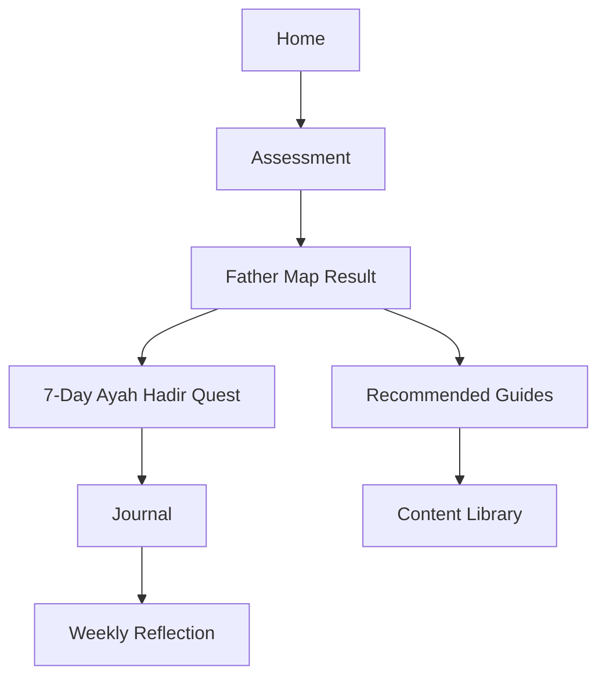

# GOODFATHER MASTER BUNDLE

Generated: 2026-07-01


---

<!-- FILE: 00_README.md -->

# GoodFather Markdown Bundle

Tanggal dibuat: 2026-07-01  
Working title: **GoodFather — Fatherhood OS for Muslim Fathers in the AI Era**

## Inti Produk

GoodFather adalah website panduan ayah Muslim modern untuk belajar menjadi ayah yang hadir, sadar, penyayang, tegas, dan visioner: mendidik anak agar punya iman, adab, karakter, kompetensi global, literasi AI, dan kebahagiaan dunia-akhirat.

Produk ini **bukan** pengganti psikolog, dokter anak, konselor keluarga, atau ustadz. GoodFather adalah platform edukasi, refleksi, assessment ringan, daily mission, dan content guide.

## File dalam bundle

1. `00_README.md` — ringkasan bundle
2. `01_PRODUCT_BLUEPRINT.md` — positioning, problem, audience, value proposition
3. `02_INFORMATION_ARCHITECTURE.md` — sitemap dan user flow
4. `03_ASSESSMENT_ENGINE.md` — pertanyaan assessment, scoring, result logic
5. `04_CONTENT_PILLARS.md` — pilar konten psikologi, syariah, karakter, AI
6. `05_CHILD_PHASE_GUIDES.md` — fase usia anak dan prioritas ayah
7. `06_BOY_GIRL_GUIDES.md` — panduan anak laki-laki/perempuan tanpa stereotip kasar
8. `07_ISLAMIC_SYARIAH_FRAMEWORK.md` — landasan syariah, adab, guardrail
9. `08_PSYCHOLOGY_FRAMEWORK.md` — landasan psikologi perkembangan
10. `09_CHARACTER_EDUCATION_FRAMEWORK.md` — karakter, SEL, Profil Pelajar Pancasila
11. `10_AI_GLOBAL_ERA_GUIDE.md` — anak di era AI, digital safety, future skills
12. `11_UI_UX_FUN_DIRECTION.md` — fun UI/UX, visual direction, gamification
13. `12_SAFETY_GUARDRAILS.md` — disclaimer, red flags, content safety
14. `13_MVP_USER_STORIES.md` — user stories dan acceptance criteria
15. `14_LOVABLE_BUILD_PROMPT.md` — prompt build website
16. `15_CONTENT_STARTER_PACK.md` — starter artikel dan struktur konten
17. `16_DAILY_MISSIONS_AND_JOURNAL.md` — daily mission dan journal templates
18. `17_REFERENCE_LIBRARY.md` — daftar referensi valid
19. `18_ROADMAP_AND_BACKLOG.md` — roadmap produk

## MVP Experience yang disarankan

**Landing Page → Assessment Ayah & Anak → Father Map → 7-Day Ayah Hadir Quest → Content Library → Journal**

## Prinsip Copywriting

- Hangat, real, tidak menggurui.
- Bicara ke ayah yang capek, sayang anak, tapi kadang bingung dan merasa bersalah.
- Hindari tone “ayah gagal”.
- Pakai tone “kita belajar bareng”.
- Islami tapi tidak kaku.
- Psikologis tapi tidak sok diagnosis.
- Fun tapi tidak kekanak-kanakan.

## Core tagline

> Menjadi ayah bukan soal sempurna.  
> Tapi soal hadir, belajar, dan pulang dengan sadar.


---

<!-- FILE: 01_PRODUCT_BLUEPRINT.md -->

# 01 — Product Blueprint

## Nama

**GoodFather**

## One-liner

**Fatherhood OS untuk ayah Muslim modern: panduan menjadi ayah yang hadir, sadar, penyayang, tegas, dan siap mendidik anak di era AI tanpa kehilangan arah akhirat.**

## Why Now

Banyak ayah modern mengalami tekanan ganda:

- tuntutan nafkah dan kerja makin tinggi,
- dunia anak berubah cepat karena internet, AI, gaming, konten pendek, dan global culture,
- banyak ayah sadar pentingnya parenting tapi tidak tahu mulai dari mana,
- konten parenting sering terlalu ibu-centric, terlalu klinis, atau terlalu menggurui,
- konten islami kadang kuat secara nasihat, tapi belum terhubung ke fase tumbuh-kembang anak.

GoodFather hadir sebagai jembatan: **iman + psikologi perkembangan + pendidikan karakter + literasi era AI + daily habit ayah.**

## Problem Statement

Ayah ingin menjadi lebih baik, tetapi sering tidak punya sistem harian untuk:

1. memahami fase anak,
2. menyesuaikan cara mendidik dengan usia dan gender anak,
3. membangun adab dan iman tanpa paksaan kaku,
4. menjaga emosi saat anak sulit,
5. mengatur screen time dan AI exposure,
6. memperbaiki relasi setelah marah,
7. tahu kapan perlu bantuan profesional.

## Target User

### Primary

Ayah Muslim usia 25–45 tahun dengan anak usia 0–12 tahun, tech-savvy, kerja padat, punya keresahan personal ingin mendidik anak dengan benar.

### Secondary

- calon ayah,
- ayah dengan anak remaja,
- ibu yang ingin mengajak suami terlibat,
- komunitas parenting/kajian keluarga,
- sekolah Islam/PAUD/TK/SD Islam.

## Value Proposition

GoodFather membantu ayah menjawab:

- “Anak gue sedang di fase apa?”
- “Sebagai ayah, prioritas gue minggu ini apa?”
- “Gue harus ngomong apa saat anak tantrum?”
- “Gimana cara ngajarin shalat/adab tanpa bikin anak trauma?”
- “Screen time anak aman atau udah kebablasan?”
- “Apa misi kecil hari ini biar gue jadi ayah yang lebih hadir?”

## Brand Personality

- **Brotherly:** seperti teman sesama ayah yang paham capeknya hidup.
- **Grounded:** berbasis referensi valid, tidak asal quotes.
- **Warm Islamic:** menenangkan, rahmah-first, bukan galak-first.
- **Fun:** pakai quest, map, badge, dan humor bapak-bapak secukupnya.
- **Actionable:** selalu berakhir dengan langkah kecil.

## Product Principles

1. **Connection before correction**  
   Koreksi anak lebih mudah saat koneksi ayah-anak sehat.

2. **Rahmah before rage**  
   Tegas boleh, tapi kasar bukan identitas ayah Muslim.

3. **Phase-aware parenting**  
   Cara mendidik anak 3 tahun beda dengan 10 tahun.

4. **Adab + skill**  
   Anak butuh akhlak, tapi juga butuh critical thinking, komunikasi, dan literasi digital.

5. **Small daily wins**  
   Ayah tidak berubah lewat motivasi besar, tapi lewat misi kecil konsisten.

6. **No diagnosis**  
   Assessment hanya edukatif, bukan diagnosis psikologi/medis.

7. **Reviewed content**  
   Konten syariah idealnya direview ustadz/ahli fikih keluarga. Konten psikologi idealnya direview psikolog anak.

## Core Experience



## MVP Scope

### Must Have

- Landing page
- Assessment
- Personalized Father Map
- Age-based guide
- Boy/girl guide
- Daily mission
- Journal template
- Reference-backed article library
- Safety/disclaimer page

### Should Have

- Bookmark
- Multi-child profile
- Progress streak
- Printable checklist
- Shareable Father Map summary

### Could Have

- AI assistant with RAG from approved content
- Community challenge
- Newsletter
- Partner directory for psychologist/ustadz

## Main Conversion CTA

- **Mulai Peta Ayah**
- **Ambil Assessment 3 Menit**
- **Mulai 7 Hari Ayah Hadir**


---

<!-- FILE: 02_INFORMATION_ARCHITECTURE.md -->

# 02 — Information Architecture

## Top Navigation

- Home
- Assessment
- Panduan Usia
- Panduan Anak Laki-laki
- Panduan Anak Perempuan
- Ayah di Era AI
- Sunnah & Adab
- Crisis Guide
- Journal
- Referensi

## Sitemap

```text
/
├── /assessment
│   ├── /assessment/start
│   ├── /assessment/questions
│   └── /assessment/result
├── /father-map
├── /guides
│   ├── /guides/0-2
│   ├── /guides/3-5
│   ├── /guides/6-9
│   ├── /guides/10-12
│   └── /guides/13-17
├── /boys
├── /girls
├── /ai-era
├── /sunnah-adab
├── /crisis
│   ├── /crisis/tantrum
│   ├── /crisis/ayah-marah
│   ├── /crisis/gadget
│   ├── /crisis/susah-shalat
│   ├── /crisis/bohong
│   ├── /crisis/sibling-rivalry
│   └── /crisis/pertanyaan-sensitif
├── /daily-mission
├── /journal
├── /printables
├── /references
└── /about
```

## Landing Page Sections

### 1. Hero

Headline:

> Belajar jadi ayah yang hadir, bukan cuma ayah yang bekerja.

Subheadline:

> GoodFather membantu ayah memahami fase tumbuh anak, membangun adab, menjaga fitrah, dan menyiapkan mereka menghadapi dunia modern tanpa kehilangan arah akhirat.

CTA:

- Mulai Peta Ayah
- Lihat Panduan Ayah

### 2. Pain Points

Cards:

- “Gue sayang anak, tapi sering keburu marah.”
- “Anak makin lengket gadget.”
- “Gue pengen ngajarin agama, tapi takut caranya kaku.”
- “Anak gue cowok/cewek, pendekatannya beda nggak?”
- “Dunia AI berubah cepat, anak harus disiapin gimana?”

### 3. How It Works

1. Isi assessment 3 menit
2. Dapat Father Map
3. Jalankan 7-Day Ayah Hadir Quest
4. Baca panduan sesuai fase anak
5. Catat refleksi ayah

### 4. Pillar Cards

- Iman & Akhirat
- Adab & Karakter
- Psikologi Anak
- Disiplin Positif
- AI & Digital Safety
- Ayah Healing & Self-Control

### 5. Product Preview

Mock cards:

- Father Map
- Daily Mission
- Crisis Card
- Journal Ayah
- Sunnah Reminder

### 6. Trust / References

- UNICEF
- WHO
- CDC
- Harvard Center on the Developing Child
- CASEL
- Character.org
- Kemendikbud/Kemendikdasmen
- OECD
- Qur'an & Hadits Sahih

### 7. Disclaimer

> GoodFather adalah platform edukasi, bukan pengganti psikolog, dokter anak, konselor keluarga, atau ustadz.

## Core User Flow

### New User Flow

1. User masuk home.
2. Klik “Mulai Peta Ayah”.
3. Pilih profil anak.
4. Jawab assessment.
5. Sistem memberi hasil:
   - fase anak,
   - prioritas ayah,
   - risiko/concern,
   - panduan usia,
   - panduan gender,
   - 7 misi harian.
6. User pilih mulai quest.
7. User catat journal.
8. User diarahkan ke artikel sesuai masalah.

## Content Page Template

```text
[Hero]
Title
Short emotional intro
Age/fase relevance

[Quick Answer]
3–5 bullet yang mudah dipahami

[Why It Happens]
Penjelasan psikologi ringan

[Islamic Lens]
Ayat/hadits/adab terkait dengan catatan sumber

[What Father Can Do]
Do / Don't / Example phrases

[Daily Mission]
1 misi kecil

[Red Flags]
Kapan perlu konsultasi profesional

[References]
Sumber valid
```

## Crisis Card Template

```text
Judul: Anak tantrum di tempat umum

Mode: Darurat 3 menit

1. Tenangkan diri ayah dulu
2. Amankan anak
3. Validasi emosi
4. Kurangi penonton/stimulus
5. Jangan debat panjang
6. Setelah reda, reconnect
7. Evaluasi trigger

Kalimat ayah:
“Abi tahu kamu marah. Abi bantu tenang dulu. Kita ngobrol setelah kamu siap.”

Don't:
- Jangan malu lalu meledak
- Jangan ceramah panjang
- Jangan ancam anak ditinggal
```


---

<!-- FILE: 03_ASSESSMENT_ENGINE.md -->

# 03 — Assessment Engine

## Nama fitur

**Father Map Assessment**

## Tujuan

Memberi peta awal edukatif untuk ayah:

- fase perkembangan anak,
- kebutuhan utama anak,
- kebiasaan ayah yang perlu diperbaiki,
- prioritas 7 hari,
- rekomendasi konten,
- red flag umum yang butuh konsultasi profesional.

Assessment ini **bukan diagnosis**.

## Assessment Sections

### A. Profil Anak

1. Nama panggilan anak
2. Gender anak
   - Laki-laki
   - Perempuan
   - Prefer tidak menjawab
3. Usia anak
   - 0–12 bulan
   - 1–2 tahun
   - 3–5 tahun
   - 6–9 tahun
   - 10–12 tahun
   - 13–17 tahun
4. Anak keberapa
5. Tinggal bersama
   - ayah-ibu
   - ibu dominan
   - ayah dominan
   - kakek/nenek
   - pengasuh
   - lainnya

### B. Kondisi Anak Saat Ini

Pilih maksimal 3:

- tantrum / ledakan emosi
- susah makan
- susah tidur
- sulit bicara / komunikasi
- terlalu lengket gadget
- susah shalat / ibadah
- sering melawan
- kurang percaya diri
- mudah takut
- mudah bohong
- sibling rivalry
- pergaulan / konten internet
- pertanyaan sensitif
- akademik/sekolah
- adab kepada orang tua
- belum ada masalah spesifik

### C. Screen & AI Exposure

1. Screen time per hari:
   - < 30 menit
   - 30–60 menit
   - 1–2 jam
   - 2–4 jam
   - > 4 jam
2. Device paling sering:
   - TV
   - YouTube
   - game
   - tablet
   - HP orang tua
   - AI/chatbot
3. Ada aturan screen-free?
   - belum
   - kadang
   - sudah konsisten
4. Anak pernah pakai AI/chatbot?
   - belum
   - pernah didampingi
   - pernah sendiri
   - tidak tahu

### D. Relasi Ayah-Anak

Skala 1–5:

- Saya punya waktu hadir penuh minimal 10 menit per hari.
- Anak nyaman cerita ke saya.
- Saya sering memeluk/mengusap/mengapresiasi anak.
- Saya mudah marah saat anak tidak patuh.
- Saya sering minta maaf setelah salah.
- Saya dan anak punya ritual bersama.

### E. Pendidikan Iman & Adab

Skala 1–5:

- Anak melihat ayah shalat/ibadah dengan konsisten.
- Saya mengajarkan agama dengan suasana hangat.
- Anak punya rutinitas doa sederhana.
- Saya mencontohkan adab bicara.
- Saya lebih sering menasihati daripada mencontohkan.
- Saya tahu target pendidikan ibadah sesuai usia anak.

### F. Kondisi Ayah

Pilih maksimal 3:

- capek kerja
- mudah marah
- jarang hadir
- bingung mulai dari mana
- merasa bersalah
- ingin lebih islami
- ingin lebih dekat dengan anak
- khawatir anak kecanduan gadget
- khawatir masa depan AI/global
- trauma dengan pola asuh lama
- beda pola asuh dengan pasangan

## Scoring Model

Gunakan scoring ringan, bukan diagnosis.

### Dimensions

1. **Connection Score**
   - quality time
   - rasa aman anak
   - ekspresi kasih sayang
   - ritual ayah-anak

2. **Self-Regulation Score**
   - frekuensi marah
   - kemampuan repair/minta maaf
   - kesadaran trigger

3. **Faith & Adab Score**
   - keteladanan ibadah
   - rutinitas doa/adab
   - pendekatan hangat

4. **Digital Safety Score**
   - screen time
   - aturan keluarga
   - co-viewing
   - AI exposure

5. **Development Awareness Score**
   - ayah paham fase usia
   - kekhawatiran milestone
   - respons terhadap red flags

6. **Character Growth Score**
   - tanggung jawab
   - empati
   - kemandirian
   - komunikasi

## Result Types

### Result 1 — Ayah Perlu Reconnect

Trigger:

- connection rendah,
- ayah sering marah,
- quality time rendah.

Message:

> Prioritas ayah minggu ini bukan menambah aturan, tapi membangun ulang rasa aman. Anak lebih mudah diarahkan ketika ia merasa dekat dan aman dengan ayahnya.

Misi:

- 10 menit hadir penuh setiap hari
- 1 pelukan sadar
- 1 kalimat apresiasi
- minta maaf kalau terlanjur membentak

### Result 2 — Anak Butuh Routine & Boundaries

Trigger:

- tantrum, sulit tidur, screen tinggi, aturan tidak konsisten.

Message:

> Anak sedang membutuhkan ritme yang lebih jelas. Bukan aturan banyak, tapi aturan kecil yang konsisten.

Misi:

- screen-free 30 menit sebelum tidur
- bedtime ritual
- visual routine chart
- batas pilihan: “Kamu mau sikat gigi dulu atau pakai piyama dulu?”

### Result 3 — Faith & Adab Foundation

Trigger:

- ayah ingin islami tapi belum ada rutinitas.

Message:

> Mulai dari teladan kecil, bukan ceramah panjang. Anak belajar agama pertama kali dari rasa aman, ritme rumah, dan contoh ayah.

Misi:

- shalat terlihat oleh anak
- doa sebelum tidur
- 1 kisah Nabi/Luqman
- adab makan sederhana

### Result 4 — Digital Safety Priority

Trigger:

- screen time tinggi, anak pakai device sendiri, AI exposure tanpa pendampingan.

Message:

> Tantangan utama bukan sekadar berapa lama layar, tapi apa yang tergantikan: tidur, gerak, bicara, bermain, dan koneksi keluarga.

Misi:

- buat family media rule
- device charging di luar kamar
- co-viewing
- matikan autoplay
- ganti 15 menit layar dengan play mission

### Result 5 — Pre-Teen / Teen Communication

Trigger:

- usia 10–17, konflik komunikasi, internet/pergaulan.

Message:

> Anak yang mulai besar butuh ayah sebagai tempat aman untuk bertanya, bukan hanya polisi aturan.

Misi:

- weekly father talk
- no-judgement listening
- diskusi aurat, adab, konten, AI, pergaulan
- sepakati aturan bersama

## Output Father Map

```yaml
child_phase: "3–5 tahun / golden age"
father_priority: "Reconnect before correction"
top_concerns:
  - "Screen time mulai tinggi"
  - "Ayah mudah marah saat anak tantrum"
weekly_focus:
  - "10 menit hadir penuh"
  - "Ritual tidur"
  - "Validasi emosi"
recommended_guides:
  - "/guides/3-5"
  - "/crisis/tantrum"
  - "/ai-era/screen-time"
  - "/sunnah-adab/rahmah"
daily_missions:
  - "Hari 1: Peluk dan hadir 10 menit"
  - "Hari 2: Validasi emosi anak"
  - "Hari 3: Buat aturan screen kecil"
```

## Safety Result Rules

Selalu munculkan alert:

> Assessment ini bukan diagnosis. Bila ayah melihat keterlambatan bicara, kehilangan kemampuan yang sebelumnya ada, perilaku menyakiti diri/orang lain, trauma berat, kekerasan, atau kekhawatiran perkembangan, konsultasikan dengan dokter anak, psikolog anak, atau profesional terkait.

## Red Flag Routing

### Milestone Concern

Route to:

- CDC milestones
- dokter anak
- psikolog anak
- tumbuh kembang anak

### Violence Concern

Route to:

- safety plan
- konselor keluarga
- perlindungan anak / layanan lokal

### Religious Question

Route to:

- ustadz/ahli fikih keluarga
- artikel syariah yang sudah direview


---

<!-- FILE: 04_CONTENT_PILLARS.md -->

# 04 — Content Pillars

GoodFather memakai 8 pilar konten.

## 1. Tauhid & Akhirat

Tujuan:

- anak mengenal Allah dengan rasa cinta, aman, dan takzim,
- ayah menjadi penunjuk arah akhirat,
- keluarga punya ritme ibadah yang hangat.

Contoh konten:

- Cara mengenalkan Allah ke anak usia 3–5
- Jangan cuma “Allah marah”, ajarkan juga “Allah Maha Penyayang”
- Nasihat Luqman sebagai framework ayah
- Anak saleh sebagai investasi akhirat

## 2. Rahmah & Emotional Safety

Tujuan:

- anak merasa aman dengan ayah,
- ayah mengurangi pola bentakan/ancaman,
- anak punya fondasi regulasi emosi.

Contoh konten:

- Kenapa anak lebih nurut setelah merasa dekat?
- Cara repair setelah ayah terlanjur marah
- Validasi emosi tanpa memanjakan
- Pelukan, eye contact, dan suara ayah

## 3. Golden Age & Development

Tujuan:

- ayah paham fase perkembangan,
- ayah tidak memaksa anak melampaui kapasitas usia,
- ayah tahu red flag umum.

Contoh konten:

- Golden age itu apa?
- Anak 3 tahun bukan mini adult
- Kenapa anak tantrum?
- Milestone bicara: kapan perlu cek?

## 4. Adab & Character Education

Tujuan:

- anak punya karakter sebelum prestasi,
- adab diajarkan melalui teladan, ritme, cerita, dan konsekuensi logis,
- sinkron dengan nilai Islam dan karakter Indonesia.

Contoh konten:

- Adab makan tanpa drama
- Adab bicara ke orang tua
- Tanggung jawab kecil sesuai usia
- Jujur, amanah, sabar, malu, empati

## 5. Positive Discipline

Tujuan:

- ayah tetap punya otoritas,
- disiplin tidak identik dengan kekerasan,
- anak belajar sebab-akibat dan tanggung jawab.

Contoh konten:

- Tegas tanpa kasar
- Konsekuensi logis vs hukuman meledak-ledak
- Cara memberi pilihan terbatas
- Rutinitas visual untuk anak kecil

## 6. Digital & AI Safety

Tujuan:

- anak tidak dikasih device tanpa arah,
- keluarga punya media plan,
- anak belajar kritis, bukan konsumtif,
- AI dipahami sebagai alat, bukan pengasuh.

Contoh konten:

- Screen time yang menggantikan tidur dan bermain
- Family media plan ala ayah
- AI boleh kapan?
- Anak harus tahu: AI bisa salah, bias, dan tidak selalu aman

## 7. Future-Ready Skills

Tujuan:

- anak siap hidup di dunia global,
- tetap punya iman dan identitas,
- punya kompetensi komunikasi, critical thinking, kreativitas, kolaborasi.

Contoh konten:

- Anak Muslim global: berakar tapi terbuka
- Critical thinking sesuai usia
- Skill komunikasi anak
- Cara melatih problem solving lewat bermain

## 8. Father Self-Work

Tujuan:

- ayah sadar pola emosinya,
- ayah punya sistem refleksi,
- ayah belajar minta maaf dan memperbaiki diri.

Contoh konten:

- Kenapa ayah gampang meledak?
- Luka parenting lama yang kebawa
- Jurnal 5 menit setelah anak tidur
- Ayah yang minta maaf tidak kehilangan wibawa

## Editorial Formula

Setiap artikel idealnya punya struktur:

1. **Masalah nyata ayah**
2. **Penjelasan singkat psikologi/fase**
3. **Lensa Islam/adab**
4. **Langkah praktis**
5. **Kalimat yang bisa ayah pakai**
6. **Daily mission**
7. **Kapan perlu bantuan profesional**
8. **Referensi**

## Example Article Skeleton

```markdown
# Anak Tantrum: Ayah Harus Ngapain?

## Quick Answer
Jangan langsung ceramah. Tenangkan diri, amankan anak, validasi emosi, baru ajak bicara setelah reda.

## Kenapa Ini Terjadi?
Anak kecil belum punya kemampuan regulasi emosi seperti orang dewasa.

## Islamic Lens
Rahmah adalah bagian dari teladan Nabi ﷺ kepada anak.

## Ayah Bisa Lakukan
- Turunkan badan sejajar anak
- Gunakan kalimat pendek
- Hindari ancaman
- Beri pilihan terbatas

## Kalimat Ayah
“Abi tahu kamu marah. Abi bantu tenang dulu. Setelah itu kita ngobrol.”

## Daily Mission
Latihan 1 kalimat validasi hari ini.

## Red Flags
Jika tantrum ekstrem, menyakiti diri/orang lain, atau disertai keterlambatan perkembangan, konsultasi profesional.

## References
...
```


---

<!-- FILE: 05_CHILD_PHASE_GUIDES.md -->

# 05 — Child Phase Guides

## Prinsip Umum

Usia anak menentukan pendekatan ayah. Anak bukan mini adult. GoodFather harus menghindari nasihat generik yang sama untuk semua usia.

## 0–2 Tahun — Fase Aman & Bonding

### Fokus Ayah

- rasa aman,
- sentuhan dan suara ayah,
- responsif terhadap tangisan,
- rutinitas tidur/makan,
- doa dan suasana rumah.

### Ayah Bisa Lakukan

- gendong, peluk, bicara lembut,
- bacakan doa pendek,
- ikut rutinitas mandi/tidur,
- main cilukba dan interaksi bolak-balik,
- jangan jadikan layar sebagai pengasuh utama.

### Jangan

- berharap anak “manja” seperti orang dewasa,
- membiarkan bayi/toddler lama dengan layar,
- marah karena anak belum bisa mengatur diri.

## 3–5 Tahun — Golden Age & Language-Emotion

### Fokus Ayah

- bahasa,
- emosi,
- bermain,
- adab dasar,
- imajinasi,
- rutinitas visual,
- disiplin lembut.

### Ayah Bisa Lakukan

- 10 menit playtime tanpa HP,
- validasi emosi,
- ajarkan nama emosi,
- pilihan terbatas,
- cerita Nabi/Luqman dengan bahasa sederhana,
- adab makan, salam, terima kasih, maaf.

### Jangan

- ceramah panjang,
- mengejek tangisan,
- membandingkan anak,
- memakai ancaman ekstrem.

## 6–9 Tahun — Habit, Responsibility, Ibadah Ringan

### Fokus Ayah

- tanggung jawab kecil,
- shalat sebagai habit bertahap,
- membaca,
- adab sosial,
- problem solving,
- screen rule.

### Ayah Bisa Lakukan

- checklist shalat ringan tanpa mempermalukan,
- tugas rumah kecil,
- weekly father activity,
- ngobrol tentang sekolah dan teman,
- ajak anak membuat aturan layar.

### Jangan

- hanya menilai akademik,
- menjadikan shalat sebagai sumber takut,
- mematikan rasa ingin tahu.

## 10–12 Tahun — Pra-Baligh & Identity

### Fokus Ayah

- aurat dan malu secara sehat,
- identitas Muslim,
- komunikasi aman,
- pergaulan,
- digital safety,
- critical thinking,
- tanggung jawab ibadah.

### Ayah Bisa Lakukan

- father talk mingguan,
- ngobrol tentang perubahan tubuh dengan adab,
- diskusi konten yang baik/buruk,
- aturan HP bersama,
- ajarkan AI sebagai alat dan risiko.

### Jangan

- mempermalukan anak soal tubuh,
- memata-matai tanpa membangun trust,
- hanya memberi larangan tanpa alasan.

## 13–17 Tahun — Baligh, Visi, Amanah

### Fokus Ayah

- keimanan sadar,
- visi hidup,
- self-control,
- pergaulan,
- seksualitas dengan adab,
- karier dan skill masa depan,
- tanggung jawab digital.

### Ayah Bisa Lakukan

- ngobrol seperti mentor,
- dengarkan sebelum koreksi,
- beri ruang aman bertanya,
- ajak mikir konsekuensi,
- libatkan anak dalam keputusan keluarga kecil,
- buat project bareng.

### Jangan

- menjadi polisi 24 jam,
- hanya nasihat satu arah,
- mengabaikan dunia digital anak,
- menertawakan keresahan remaja.

## Phase Matrix

| Fase | Core Need Anak | Peran Ayah | Konten Utama |
|---|---|---|---|
| 0–2 | rasa aman | pelindung & penenang | bonding, rutinitas |
| 3–5 | bahasa & emosi | teman bermain & batas aman | tantrum, adab dasar |
| 6–9 | habit & tanggung jawab | coach harian | shalat, tugas kecil |
| 10–12 | identitas | mentor awal | pra-baligh, digital safety |
| 13–17 | makna & autonomy | mentor dewasa | visi, pergaulan, AI |


---

<!-- FILE: 06_BOY_GIRL_GUIDES.md -->

# 06 — Boy & Girl Guides

## Prinsip Penting

Perbedaan anak laki-laki dan perempuan harus dibahas dengan adab, bukan stereotip kasar.

GoodFather tidak memakai pendekatan:

- “anak cowok jangan nangis”
- “anak cewek cuma harus lembut”
- “cowok harus keras”
- “cewek harus diam”

GoodFather memakai pendekatan:

- setiap anak butuh iman, adab, aman, kasih sayang, batas, dan teladan,
- ada kebutuhan pendidikan spesifik sesuai fitrah, fase, dan realitas sosial,
- ayah harus jadi figur aman untuk anak laki-laki maupun perempuan.

## Panduan Ayah untuk Anak Laki-laki

### Core Role Ayah

Ayah adalah contoh maskulinitas sehat: kuat tanpa kasar, tegas tanpa zalim, berani tanpa merendahkan, lembut tanpa kehilangan wibawa.

### Fokus Pendidikan

- tanggung jawab,
- adab kepada ibu,
- regulasi emosi,
- amanah,
- keberanian moral,
- menjaga pandangan,
- shalat,
- kerja keras,
- menghormati perempuan.

### Kalimat Ayah

- “Laki-laki kuat itu bukan yang paling keras, tapi yang bisa menahan diri.”
- “Abi juga bisa marah, tapi kita belajar tidak menyakiti.”
- “Kita bantu ibu bukan karena disuruh, tapi karena itu adab.”
- “Berani itu termasuk berani jujur.”

### Daily Missions

- Ajak anak laki-laki membantu pekerjaan rumah.
- Latih meminta maaf setelah salah.
- Buat project kecil: rakit, gambar, bersih-bersih, olahraga.
- Diskusi tokoh laki-laki saleh: Nabi Ibrahim, Nabi Yusuf, Luqman, Rasulullah ﷺ.

## Panduan Ayah untuk Anak Perempuan

### Core Role Ayah

Ayah adalah figur aman pertama. Cara ayah memperlakukan anak perempuan dapat membentuk standar rasa aman, self-worth, dan batas relasi dengan laki-laki.

### Fokus Pendidikan

- rasa aman,
- self-worth,
- validasi emosi,
- adab aurat dan malu dengan cara lembut,
- keberanian bicara,
- perlindungan tanpa overcontrol,
- komunikasi tentang tubuh,
- standar perlakuan baik dari laki-laki.

### Kalimat Ayah

- “Kamu berharga karena Allah muliakan kamu, bukan karena penilaian orang.”
- “Abi dengerin dulu, kamu aman cerita ke Abi.”
- “Menjaga diri itu bukan karena kamu lemah, tapi karena kamu berharga.”
- “Kalau ada yang bikin kamu tidak nyaman, kamu boleh cerita tanpa takut dimarahin dulu.”

### Daily Missions

- 10 menit listening tanpa interupsi.
- Puji usaha/akhlak, bukan cuma fisik.
- Bantu anak menyebut perasaan.
- Ajarkan boundary: boleh bilang tidak, boleh minta bantuan.

## Shared Foundation

Anak laki-laki dan perempuan sama-sama butuh:

- tauhid,
- kasih sayang,
- adab,
- kejujuran,
- tanggung jawab,
- rasa aman,
- komunikasi,
- critical thinking,
- digital safety,
- teladan ayah.

## Content Guardrail

Saat membahas gender:

- hindari klaim biologis/psikologis yang tidak punya sumber,
- jangan menggeneralisasi semua anak,
- selalu beri ruang individual difference,
- untuk isu pubertas/seksualitas, gunakan bahasa adab dan sarankan pendampingan ahli bila perlu.


---

<!-- FILE: 07_ISLAMIC_SYARIAH_FRAMEWORK.md -->

# 07 — Islamic & Syariah Framework

## Positioning Syariah

GoodFather menggunakan Islam sebagai kompas nilai:

- tauhid,
- rahmah,
- amanah,
- adab,
- ihsan,
- tanggung jawab keluarga,
- pendidikan shalat,
- akhlak kepada manusia,
- orientasi akhirat.

GoodFather **bukan layanan fatwa**. Untuk pertanyaan fikih spesifik, arahkan ke ustadz/ahli fikih keluarga.

## Landasan Qur'an

### At-Tahrim 66:6

Tema:

- ayah/keluarga punya tanggung jawab menjaga keluarga dari keburukan dunia-akhirat,
- bukan hanya memberi nafkah, tapi memberi arah.

Implementasi konten:

- ayah sebagai penjaga arah rumah,
- safety spiritual,
- teladan ibadah,
- memastikan rumah tidak kehilangan kompas akhirat.

Source:
https://quran.com/en/at-tahrim/6

### Luqman 31:13–19

Tema:

- tauhid,
- hormat kepada orang tua,
- muraqabah,
- shalat,
- amar ma'ruf nahi munkar,
- sabar,
- rendah hati,
- adab berjalan dan bicara.

Implementasi konten:

- **Luqman Father Map**: ayah menasihati dengan panggilan sayang,
- nasihat ayah bukan cuma aturan, tapi value system,
- pendidikan iman dan akhlak dapat disampaikan lewat dialog.

Source:
https://quran.com/en/luqman/13-19

## Landasan Hadits

### Ayah sebagai penjaga keluarga

Sahih Muslim 1829a / Sahih al-Bukhari 7138

Tema:

- setiap pemimpin akan dimintai pertanggungjawaban,
- seorang laki-laki adalah penjaga atas keluarganya.

Sources:
https://sunnah.com/muslim:1829a  
https://sunnah.com/bukhari:7138

### Rahmah kepada anak

Sahih Muslim 2318a / Sahih al-Bukhari 5997

Tema:

- Nabi ﷺ mencontohkan kasih sayang fisik dan emosional kepada anak,
- rahmah bukan kelemahan.

Sources:
https://sunnah.com/muslim:2318a  
https://sunnah.com/bukhari:5997

### Anak saleh sebagai amal jariyah

Sahih Muslim 1631 / Riyad as-Salihin 1383

Tema:

- anak saleh yang mendoakan orang tua adalah amal yang terus mengalir,
- parenting adalah proyek akhirat, bukan hanya proyek prestasi.

Sources:
https://sunnah.com/muslim:1631  
https://sunnah.com/riyadussalihin:1383

### Pendidikan shalat bertahap

Sunan Abi Dawud 495

Tema:

- anak diperkenalkan shalat sejak usia 7,
- pendidikan ibadah dilakukan bertahap,
- bagian disiplin fisik harus dibahas dengan sangat hati-hati dan mengacu pada penjelasan ulama, hukum setempat, keselamatan anak, dan prinsip tidak membahayakan.

Source:
https://sunnah.com/abudawud:495

## GoodFather Islamic Content Principles

1. **Rahmah-first**
   - Islam dalam rumah dimulai dari rasa aman dan kasih sayang.

2. **Teladan sebelum tuntutan**
   - Ayah shalat, jujur, lembut, dan bertanggung jawab sebelum menuntut anak.

3. **Fase-aware ibadah**
   - Target ibadah anak disesuaikan usia.

4. **Adab tidak dipisah dari iman**
   - Anak tidak hanya “pintar agama”, tapi berakhlak kepada manusia.

5. **Tidak asal klaim sunnah**
   - Setiap konten syariah mencantumkan sumber dan status kehati-hatian.

6. **No spiritual abuse**
   - Jangan jadikan Allah hanya sebagai ancaman.
   - Jangan mempermalukan anak atas kesalahan ibadah.
   - Jangan gunakan agama untuk melampiaskan emosi ayah.

## Islamic UX Microcopy

- “Mulai dengan bismillah.”
- “Misi kecil, niat besar.”
- “Ayah hadir hari ini.”
- “Rahmah dulu, koreksi kemudian.”
- “Anak aman, nasihat masuk.”
- “Pulang dengan sadar.”
- “Satu pelukan bisa jadi dakwah pertama.”

## Review Workflow

Sebelum publish artikel syariah:

1. Tulis draft.
2. Tandai ayat/hadits.
3. Cek sumber primer.
4. Hindari memotong konteks.
5. Review ustadz/ahli syariah.
6. Tambahkan disclaimer bila isu fikih khilafiyah.
7. Publish dengan “Reviewed by”.


---

<!-- FILE: 08_PSYCHOLOGY_FRAMEWORK.md -->

# 08 — Psychology & Child Development Framework

## Scope

GoodFather membahas psikologi sebagai edukasi parenting umum:

- perkembangan anak,
- regulasi emosi,
- attachment/rasa aman,
- disiplin positif,
- milestone umum,
- peran caregiver responsif,
- red flags untuk konsultasi.

GoodFather tidak memberi diagnosis.

## Core Concepts

### 1. Early Childhood Development

Tahun-tahun awal sangat penting untuk perkembangan otak, bahasa, emosi, dan perilaku. Konten GoodFather harus memakai fase usia agar ayah tidak menuntut anak melebihi kapasitas perkembangannya.

Sources:
- UNICEF Early Childhood Development
- UNICEF Data ECD
- WHO Nurturing Care Framework

### 2. Nurturing Care

WHO memakai lima komponen:

1. kesehatan,
2. nutrisi,
3. keamanan dan keselamatan,
4. responsive caregiving,
5. kesempatan belajar awal.

Implementasi GoodFather:

- artikel usia 0–5 tidak hanya soal akademik,
- ayah diajak hadir, responsif, dan menciptakan lingkungan aman.

### 3. Serve and Return

Anak “melempar serve” lewat tangisan, suara, ekspresi, menunjuk, bertanya, atau mengajak main. Ayah “return” dengan merespons hangat.

Implementasi:

- misi 10 menit playtime,
- eye contact,
- ngobrol saat mandi/makan,
- respon terhadap pertanyaan anak.

Source:
https://developingchild.harvard.edu/key-concept/serve-and-return/

### 4. Toxic Stress

Stres berat dan berkepanjangan tanpa dukungan orang dewasa responsif dapat berdampak buruk. Caregiver yang aman membantu menjadi buffer.

Implementasi:

- jangan normalisasi kekerasan,
- jangan mempermalukan anak,
- berikan crisis guide untuk ayah yang sering meledak,
- rujuk profesional untuk kekerasan/trauma.

Source:
https://developingchild.harvard.edu/resource-guides/guide-toxic-stress/

### 5. Developmental Milestones

Milestone membantu orang tua mengamati perkembangan bermain, belajar, bicara, bergerak, dan perilaku anak.

Implementasi:

- buat milestone awareness, bukan panic checklist,
- selalu arahkan ke dokter/psikolog jika ada concern.

Source:
https://www.cdc.gov/act-early/index.html

### 6. Positive Discipline

Disiplin bukan hanya menghukum, tapi mengajar. Ayah perlu ekspektasi jelas, hubungan sehat, rutinitas, konsekuensi logis, dan konsistensi.

Source:
https://www.unicef.org/parenting/child-care/how-discipline-your-child-smart-and-healthy-way

## Red Flag Examples

### 0–5 Tahun

Arahkan ke profesional bila:

- kehilangan kemampuan yang sebelumnya sudah ada,
- tidak merespons suara/nama secara konsisten,
- tidak ada kontak mata sama sekali,
- keterlambatan bicara yang mengkhawatirkan,
- perilaku menyakiti diri/orang lain berulang,
- tantrum ekstrem sangat sering dan sulit reda,
- kekhawatiran orang tua yang kuat.

### Usia Sekolah

Arahkan ke profesional bila:

- kecemasan berat,
- agresi berulang,
- bullying,
- perubahan perilaku ekstrem,
- gangguan tidur/makan berat,
- tanda depresi,
- self-harm talk,
- trauma/kekerasan.

## Tone Rule

Jangan tulis:

> Anak ayah kemungkinan ADHD/autisme/depresi.

Tulis:

> Ini bisa punya banyak penyebab. Bila pola ini sering terjadi, intens, atau mengganggu fungsi harian, sebaiknya konsultasi dengan dokter anak/psikolog anak untuk evaluasi yang tepat.

## Psychology Content Template

```markdown
## Apa yang terjadi?
Penjelasan ringan sesuai fase.

## Apa yang anak butuhkan?
Rasa aman / rutinitas / batas / bahasa emosi / tidur / gerak.

## Apa yang ayah bisa lakukan hari ini?
3 langkah kecil.

## Kapan perlu bantuan?
Red flags.

## Referensi
Sumber valid.
```


---

<!-- FILE: 09_CHARACTER_EDUCATION_FRAMEWORK.md -->

# 09 — Character Education Framework

## Goal

GoodFather ingin anak tumbuh sebagai:

- hamba Allah yang beriman,
- anak yang beradab,
- manusia yang punya karakter,
- warga Indonesia yang baik,
- pembelajar global yang kritis,
- pengguna teknologi yang bijak.

## Framework Gabungan

GoodFather menggabungkan:

1. **Islamic Adab**
2. **CASEL Social Emotional Learning**
3. **Character.org 11 Principles**
4. **Profil Pelajar Pancasila**
5. **OECD Learning Compass 2030**

## CASEL SEL Mapping

Lima kompetensi SEL:

| CASEL | Versi GoodFather | Contoh Praktik Ayah |
|---|---|---|
| Self-awareness | Anak mengenal emosi & niat | “Kamu marah atau kecewa?” |
| Self-management | Anak belajar mengatur diri | napas, jeda, rutinitas |
| Social awareness | Anak punya empati | “Menurutmu adik merasa apa?” |
| Relationship skills | Anak bisa komunikasi | minta maaf, minta tolong |
| Responsible decision-making | Anak paham konsekuensi | pilihan terbatas, evaluasi akibat |

Source:
https://casel.org/fundamentals-of-sel/

## Character.org Mapping

GoodFather mengambil prinsip:

- karakter sebagai budaya rumah,
- nilai inti didefinisikan,
- ayah/ibu sebagai teladan,
- hubungan peduli,
- kesempatan praktik karakter,
- refleksi rutin.

Source:
https://character.org/11-principles-in-schools/

## Profil Pelajar Pancasila Mapping

| Dimensi | GoodFather Translation | Praktik Rumah |
|---|---|---|
| Beriman, bertakwa, akhlak mulia | Tauhid, ibadah, adab | doa, shalat, jujur |
| Berkebinekaan global | Berakar, tapi mampu menghargai | diskusi budaya, bahasa |
| Gotong royong | Peduli & bantu | tugas rumah bersama |
| Mandiri | Bertanggung jawab | bereskan mainan |
| Bernalar kritis | Tidak mudah tertipu | cek fakta, tanya alasan |
| Kreatif | Mencipta solusi | project ayah-anak |

Source:
https://pusatinformasi.rumahpendidikan.kemendikdasmen.go.id/hc/id/articles/52478172156953-Profil-Pelajar-Pancasila

## OECD Future Skills Mapping

GoodFather mengadopsi prinsip:

- student/child agency,
- well-being,
- knowledge, skills, attitudes, values,
- future-ready learning.

Source:
https://www.oecd.org/en/about/projects/future-of-education-and-skills-2030.html

## GoodFather Character Pillars

### 1. Iman

Indikator:

- anak mengenal Allah dengan rasa cinta dan hormat,
- anak melihat teladan ibadah,
- anak punya doa harian.

### 2. Adab

Indikator:

- salam,
- terima kasih,
- maaf,
- izin,
- menjaga bicara,
- hormat kepada orang tua.

### 3. Amanah

Indikator:

- menjaga barang,
- jujur,
- menyelesaikan tugas kecil.

### 4. Rahmah

Indikator:

- peduli,
- membantu,
- tidak menyakiti.

### 5. Sabar

Indikator:

- menunggu giliran,
- mengelola emosi,
- tidak mudah menyerah.

### 6. Berani

Indikator:

- jujur,
- bertanya,
- mencoba,
- membela yang benar.

### 7. Kritis

Indikator:

- bertanya “kenapa?”,
- tidak percaya semua konten,
- membedakan fakta/opini.

### 8. Kreatif

Indikator:

- membuat sesuatu,
- mencari alternatif,
- bermain imajinatif.

## Character Practice Cards

```yaml
card: "Adab Bicara"
age: "3–5"
mission: "Hari ini latih 3 kata: tolong, maaf, terima kasih."
father_phrase: "Abi senang kamu bilang tolong. Itu adab yang indah."
islamic_lens: "Akhlak baik adalah bagian dari iman."
psychology_lens: "Anak kecil belajar lewat modeling dan pengulangan."
```


---

<!-- FILE: 10_AI_GLOBAL_ERA_GUIDE.md -->

# 10 — AI & Global Era Guide

## Positioning

GoodFather tidak anti teknologi. GoodFather juga tidak membiarkan teknologi menggantikan ayah.

Prinsip:

> AI boleh jadi alat belajar, tapi tidak boleh jadi pengasuh utama, sumber nilai utama, atau teman emosional utama anak.

## Age-Based AI Guidance

### 0–5 Tahun

Prioritas:

- bermain fisik,
- bahasa manusia,
- bonding,
- tidur,
- gerak,
- imajinasi,
- interaksi langsung.

Guideline:

- hindari AI companion/toy sebagai pengganti interaksi,
- screen time harus sangat hati-hati,
- jika ada layar, dampingi dan pilih konten berkualitas.

### 6–9 Tahun

Prioritas:

- literasi digital dasar,
- aturan device,
- co-viewing/co-use,
- tanya jawab kritis.

Guideline:

- AI hanya dengan pendampingan,
- ajarkan “AI bisa salah”,
- ajarkan tidak membagikan data pribadi.

### 10–12 Tahun

Prioritas:

- critical thinking,
- fact-checking,
- etika tugas sekolah,
- privasi,
- konten aman.

Guideline:

- mulai diskusi AI sebagai alat,
- jangan pakai AI untuk menipu tugas,
- belajar membandingkan sumber.

### 13–17 Tahun

Prioritas:

- etika AI,
- produktivitas,
- karier,
- prompt literacy,
- bias,
- deepfake,
- privacy,
- digital footprint.

Guideline:

- anak boleh belajar AI lebih serius,
- ayah menjadi mentor nilai dan etika,
- diskusi risiko pornografi, manipulasi, deepfake, cyberbullying.

## Family Media Plan

Gunakan prinsip:

- zona bebas layar: kamar tidur, meja makan, waktu ibadah,
- waktu bebas layar: sebelum tidur, family time,
- co-viewing untuk anak kecil,
- aturan charging device di luar kamar,
- matikan autoplay,
- ayah juga ikut aturan.

Source:
https://www.healthychildren.org/English/fmp/Pages/MediaPlan.aspx

## AI Literacy for Children

Berdasarkan UNESCO AI competency framework, anak perlu belajar:

1. Human-centred mindset
2. Ethics of AI
3. AI techniques and applications
4. AI system design

Versi GoodFather:

- AI itu alat, bukan Tuhan, bukan guru absolut.
- AI bisa salah.
- AI bisa bias.
- AI tidak boleh tahu rahasia keluarga.
- AI tidak menggantikan adab kepada guru/orang tua.
- Pakai AI untuk belajar, bukan menipu.
- Cek sumber sebelum percaya.
- Jaga privasi.
- Jangan upload foto/data pribadi sembarangan.

Sources:
https://www.unesco.org/en/articles/ai-competency-framework-students  
https://www.unicef.org/innocenti/reports/policy-guidance-ai-children

## GoodFather Digital Safety Rules

### Untuk Ayah

- Jangan kasih HP saat ayah capek sebagai default coping.
- Jangan jadikan YouTube sebagai babysitter utama.
- Jangan cuma melarang, beri alternatif.
- Jangan punya aturan anak tapi ayah sendiri scroll terus.
- Jadwalkan “Ayah Offline Mode”.

### Untuk Anak

- Tidak ada device di kamar saat tidur.
- Tidak share nama lengkap, alamat, sekolah, wajah, atau nomor.
- Tanya ayah/ibu sebelum download.
- Stop kalau konten bikin takut, malu, bingung, atau penasaran yang tidak sehat.
- Cerita ke ayah tidak langsung dimarahin dulu.

## Content Ideas

- “AI bukan pengganti ayah”
- “Cara ngajarin anak cek fakta”
- “Screen time bukan cuma durasi, tapi apa yang digantikan”
- “Family Media Contract”
- “Anak nanya ChatGPT: boleh?”
- “Deepfake dan aurat digital”
- “Anak Muslim di dunia global: root & wings”

## Fun Feature Ideas

- **Ayah Offline Mode:** timer 20 menit tanpa HP.
- **Screen Swap Mission:** ganti 15 menit layar dengan main fisik.
- **AI Detective:** anak dan ayah cek jawaban AI bersama.
- **Digital Amanah Badge:** badge untuk anak yang menjaga aturan device.


---

<!-- FILE: 11_UI_UX_FUN_DIRECTION.md -->

# 11 — UI/UX Fun Direction

## Design Goal

GoodFather harus terasa:

- fun,
- premium,
- hangat,
- modern,
- Islami subtle,
- ayah-friendly,
- tidak seperti template dakwah kaku,
- tidak seperti SaaS korporat dingin,
- tidak seperti aplikasi anak-anak yang terlalu childish.

## Visual Direction

### Keywords

- fatherhood OS
- warm adventure
- daily quest
- compass
- home
- night journal
- father-child silhouette
- map
- stars
- soft Islamic geometry
- playful cards
- cozy dashboard

### Mood

> “Ayah pulang malam, buka GoodFather, merasa disambut — bukan dihakimi.”

## Color Palette

### Primary

- Deep Navy: `#0E1B2A`
- Warm Cream: `#FFF4E3`
- Olive Green: `#5D6B3F`
- Soft Gold: `#D8A84E`

### Accent Fun

- Sky Blue: `#74B9FF`
- Coral: `#FF8A65`
- Mint: `#8FDCC2`
- Lavender: `#B9A7FF`

### Use

- Navy untuk trust dan depth.
- Cream untuk warmth.
- Gold untuk spiritual/premium.
- Accent untuk badges/quests/cards.

## Typography

- Heading: editorial serif atau rounded display.
- Body: clean sans, readable.
- Arabic/Qur'an snippets: font khusus yang rapi bila diperlukan.
- Jangan over-decorative.

## UI Components

### 1. Father Map Card

```text
┌──────────────────────────────┐
│ 🧭 Father Map                │
│ Fase Anak: Golden Age 3–5    │
│ Prioritas: Reconnect         │
│ Misi Minggu Ini: 7           │
│ Badge: Ayah Hadir Level 1    │
└──────────────────────────────┘
```

### 2. Daily Mission Card

```text
🌙 Misi Hari Ini
Peluk anak 20 detik dan bilang:
"Abi sayang kamu. Makasih ya sudah belajar hari ini."

[Mulai Misi] [Tandai Selesai]
```

### 3. Crisis Button

Floating button:

> “Lagi Panik?”

Opens:

- Tantrum mode
- Ayah terlanjur marah
- Anak lihat konten buruk
- Anak susah shalat
- Anak bohong

### 4. Ayah Offline Mode

Timer:

- 10 min
- 20 min
- 30 min

Microcopy:

> HP istirahat. Ayah hadir.

### 5. Quest Path

```text
Day 1: Hadir
Day 2: Dengar
Day 3: Peluk
Day 4: Batas
Day 5: Doa
Day 6: Main
Day 7: Refleksi
```

### 6. Badge System

Badges:

- Ayah Hadir
- Rahmah Mode
- No-Yell Day
- Story Night
- Digital Amanah
- Luqman Listener
- Repair Hero
- Shalat Buddy
- Screen Swap
- Journal Keeper

### 7. Kids Profile

Each child as a planet/star:

- “Alya — 4 tahun — Golden Age”
- “Hasan — 8 tahun — Habit Builder”

## Microcopy Style

### Instead of

> Assessment Parenting

Use:

> Peta Ayah

### Instead of

> Submit

Use:

> Lihat Peta Gue

### Instead of

> Your result is poor

Use:

> Ada area yang bisa ayah kuatkan minggu ini.

### Instead of

> Failed mission

Use:

> Belum jalan hari ini. Besok mulai lagi, yah.

### Instead of

> Streak lost

Use:

> Ayah manusia. Reset dengan bismillah.

## Fun Tone Examples

- “Mode ayah sabar: loading...”
- “Jangan debat sama toddler. Mereka belum baca Terms & Conditions.”
- “HP bisa dicharge. Hati anak juga.”
- “Ayah bukan robot. Tapi bisa update version.”
- “Patch note hari ini: lebih sabar 1%.”
- “Tantrum detected. Activate Rahmah Mode.”
- “Mission complete: anak merasa dilihat.”

## Layout Direction

### Home

- Big emotional hero.
- Floating cards.
- Smooth scroll.
- Small animations: stars, compass, cards.
- No overdone 3D AI slop.

### Assessment

- One question per screen.
- Progress bar as journey map.
- Friendly illustrations.
- Save partial answer.
- Mobile-first.

### Result

- Big Father Map.
- 3 priorities max.
- Do not overwhelm.
- CTA to 7-Day Quest.

### Article

- Short sections.
- Crisis summary at top.
- “Kalimat ayah” blocks.
- Sticky daily mission.

### Dashboard

- Child cards.
- Today's mission.
- Journal streak.
- Recommended reading.
- Crisis shortcut.

## Animation Rules

Use animation to support, not distract:

- card hover gentle,
- quest path reveal,
- progress bar,
- badge unlock,
- night stars subtle,
- button micro-interaction.

Avoid:

- spinning 3D objects everywhere,
- too many gradients,
- fake AI faces,
- generic stock family photos,
- overused mosque silhouette.

## Image/Illustration Style

Recommended:

- abstract father-child silhouettes,
- cozy home scenes,
- hands, books, sajadah, stars,
- map/compass metaphors,
- simple character avatars.

Avoid:

- realistic generated faces,
- overly Arab desert cliché,
- guilt-heavy sad child imagery,
- “perfect family” stock photo.

## Example Hero Wireframe

```text
------------------------------------------------
GOODFATHER
[Home] [Assessment] [Guides] [Journal]

Belajar jadi ayah yang hadir,
bukan cuma ayah yang bekerja.

Panduan ayah Muslim modern untuk memahami fase anak,
membangun adab, menjaga fitrah, dan menyiapkan mereka
menghadapi era AI tanpa kehilangan arah akhirat.

[Mulai Peta Ayah] [Lihat 7-Day Quest]

      🧭 Father Map Preview
      🌙 Daily Mission
      🛡 Crisis Mode
------------------------------------------------
```


---

<!-- FILE: 12_SAFETY_GUARDRAILS.md -->

# 12 — Safety Guardrails

## Core Disclaimer

GoodFather adalah platform edukasi dan refleksi untuk ayah. GoodFather bukan pengganti:

- dokter anak,
- psikolog anak,
- psikiater,
- konselor keluarga,
- ustadz/ahli fikih,
- layanan perlindungan anak.

Assessment GoodFather bukan diagnosis.

## Medical/Psychological Safety

### Jangan

- mendiagnosis ADHD, autisme, depresi, anxiety, speech delay, trauma, dll.
- memberi terapi klinis.
- menyarankan menghentikan obat/terapi.
- menjanjikan hasil.
- menyalahkan ayah/ibu atas kondisi anak.

### Boleh

- edukasi umum,
- jelaskan kemungkinan banyak faktor,
- berikan langkah aman,
- arahkan konsultasi profesional.

## Religious Safety

### Jangan

- asal klaim “ini sunnah” tanpa sumber,
- memutuskan hukum fikih spesifik,
- memakai agama untuk membuat ayah/anak merasa hopeless,
- normalisasi kekerasan atas nama disiplin,
- mengabaikan perbedaan pendapat ulama.

### Boleh

- mengutip sumber primer dengan hati-hati,
- arahkan ke ustadz/ahli fikih,
- tekankan rahmah, adab, amanah,
- bedakan nasihat umum dan fatwa.

## Child Safety

### Red Flags: Immediate Help

Arahkan cari bantuan segera bila ada:

- ancaman menyakiti diri,
- anak disakiti secara fisik/seksual,
- kekerasan rumah tangga,
- anak hilang/ditelantarkan,
- cedera serius,
- gangguan makan/tidur berat,
- perubahan perilaku ekstrem,
- konten eksploitasi anak,
- grooming atau ancaman online.

## Crisis Content Rules

Untuk topik seperti tantrum, gadget, bohong, susah shalat:

- mulai dari menenangkan ayah,
- hindari mempermalukan anak,
- hindari ancaman,
- beri kalimat praktis,
- beri red flag.

## Sensitive Topics

Topik yang perlu review ekstra:

- pubertas,
- seksualitas,
- pornografi,
- kekerasan,
- disiplin fisik,
- trauma,
- perceraian,
- hak asuh,
- gangguan perkembangan,
- self-harm,
- fatwa hukum keluarga.

## Standard Safety Copy

```markdown
Catatan: Panduan ini bersifat edukatif. Bila perilaku anak intens, berulang, membahayakan, atau membuat ayah/ibu sangat khawatir, konsultasikan dengan dokter anak, psikolog anak, atau profesional terkait. Untuk pertanyaan hukum syariah spesifik, konsultasikan dengan ustadz/ahli fikih keluarga.
```

## Content Review Checklist

Before publish:

- [ ] Apakah ada sumber valid?
- [ ] Apakah ada overclaim?
- [ ] Apakah ada potensi diagnosis?
- [ ] Apakah ada potensi fatwa?
- [ ] Apakah memberi langkah aman?
- [ ] Apakah ada red flag?
- [ ] Apakah tone menyalahkan?
- [ ] Apakah sesuai fase usia?
- [ ] Apakah perlu reviewer profesional?

## AI Assistant Guardrails

Jika GoodFather punya AI assistant:

- jawaban hanya dari knowledge base yang direview,
- selalu tampilkan sumber,
- tidak diagnosis,
- tidak fatwa,
- tidak menjawab konten seksual eksplisit anak,
- arahkan ke bantuan profesional untuk crisis,
- simpan data anak minimal dan aman,
- jangan minta data sensitif berlebihan.


---

<!-- FILE: 13_MVP_USER_STORIES.md -->

# 13 — MVP User Stories

## Epic 1 — Landing Page

### Story

Sebagai ayah baru, saya ingin memahami apa itu GoodFather agar saya merasa platform ini relevan dan aman.

### Acceptance Criteria

- Ada hero yang jelas.
- Ada CTA assessment.
- Ada penjelasan sumber referensi.
- Ada disclaimer.
- Mobile responsive.
- Tone hangat.

## Epic 2 — Assessment

### Story

Sebagai ayah, saya ingin mengisi assessment singkat tentang anak dan diri saya agar mendapatkan peta awal yang sesuai.

### Acceptance Criteria

- Assessment selesai dalam 3–5 menit.
- Pertanyaan dibagi per langkah.
- Bisa memilih anak laki-laki/perempuan dan usia.
- Bisa memilih concern utama.
- Tidak memakai istilah diagnosis.
- Ada progress indicator.

## Epic 3 — Father Map Result

### Story

Sebagai ayah, saya ingin mendapat hasil yang jelas, tidak menghakimi, dan bisa langsung dilakukan.

### Acceptance Criteria

- Menampilkan fase anak.
- Menampilkan 3 prioritas maksimal.
- Menampilkan recommended guide.
- Menampilkan 7-day quest.
- Menampilkan disclaimer.
- Bisa share/download summary.

## Epic 4 — Daily Mission

### Story

Sebagai ayah sibuk, saya ingin misi kecil harian agar bisa mulai berubah tanpa overwhelmed.

### Acceptance Criteria

- Misi bisa selesai dalam 5–20 menit.
- Ada instruksi jelas.
- Ada kalimat contoh.
- Ada tombol selesai.
- Tidak ada punishment kalau skip.

## Epic 5 — Journal

### Story

Sebagai ayah, saya ingin mencatat refleksi singkat agar sadar pola saya dengan anak.

### Acceptance Criteria

- Template 3–5 pertanyaan.
- Bisa simpan lokal/MVP.
- Ada mood check.
- Ada “besok mau coba apa?”
- Tidak memaksa data sensitif.

## Epic 6 — Content Library

### Story

Sebagai ayah, saya ingin membaca panduan sesuai usia, gender, dan masalah anak.

### Acceptance Criteria

- Ada filter usia.
- Ada filter topik.
- Ada crisis guide.
- Ada sumber.
- Ada daily mission di akhir artikel.

## Epic 7 — Crisis Mode

### Story

Sebagai ayah yang sedang panik, saya ingin panduan cepat 3 menit agar tidak merespons dengan marah.

### Acceptance Criteria

- Tombol mudah ditemukan.
- Langkah pendek.
- Kalimat siap pakai.
- Red flag bantuan profesional.
- Tidak ada artikel panjang di mode crisis.

## Epic 8 — Reference Library

### Story

Sebagai pengguna, saya ingin tahu sumber GoodFather agar percaya bahwa kontennya tidak asal.

### Acceptance Criteria

- Referensi dikelompokkan.
- Ada link sumber.
- Ada penjelasan kenapa sumber dipakai.
- Ada badge: psychology, syariah, character, AI.


---

<!-- FILE: 14_LOVABLE_BUILD_PROMPT.md -->

# 14 — Lovable Build Prompt

Copy-paste prompt ini ke Lovable/Cursor sebagai initial build prompt.

---

Build a premium, fun, mobile-first website called **GoodFather**.

GoodFather is a “Fatherhood OS” for modern Muslim fathers in the AI era. It helps fathers become present, emotionally safe, spiritually grounded, and practical educators for their children.

## Product Goal

Create an MVP web app with:

1. Landing page
2. Father Map Assessment
3. Personalized result page
4. 7-Day Ayah Hadir Quest
5. Content library
6. Crisis guide
7. Journal page
8. Reference library
9. Safety disclaimer

## Brand Tone

Warm, brotherly, grounded, Islamic but not preachy, psychologically aware but not clinical, fun but not childish.

Avoid AI slop. Avoid generic stock-photo look. Avoid overused mosque/green-gold clichés. Use subtle Islamic geometry, compass/map metaphor, cozy father-child mood, stars, journal, home, and daily quest cards.

## Visual Style

Palette:

- Deep Navy `#0E1B2A`
- Warm Cream `#FFF4E3`
- Olive Green `#5D6B3F`
- Soft Gold `#D8A84E`
- Accent Sky Blue `#74B9FF`
- Accent Coral `#FF8A65`
- Accent Mint `#8FDCC2`
- Accent Lavender `#B9A7FF`

Use rounded cards, soft shadows, playful badges, quest path, gentle micro-animations. Mobile-first.

## Landing Page Copy

Hero headline:

“Belajar jadi ayah yang hadir, bukan cuma ayah yang bekerja.”

Subheadline:

“GoodFather membantu ayah memahami fase tumbuh anak, membangun adab, menjaga fitrah, dan menyiapkan mereka menghadapi dunia modern tanpa kehilangan arah akhirat.”

CTA:

- “Mulai Peta Ayah”
- “Lihat Panduan Ayah”

## Pages

### `/`

Sections:

- hero
- pain points
- how it works
- feature cards
- pillar cards
- product preview
- references
- disclaimer

### `/assessment`

Build a multi-step assessment with these sections:

- child profile
- current child challenges
- screen/AI exposure
- father-child relationship
- faith/adab routine
- father condition

Use one question per screen with progress indicator.

### `/assessment/result`

Show a Father Map card:

- child phase
- father priority
- top concerns
- weekly focus
- recommended guides
- 7-day quest

Do not call it diagnosis.

### `/guides`

Content cards by age:

- 0–2
- 3–5
- 6–9
- 10–12
- 13–17

### `/crisis`

Crisis mode cards:

- Tantrum
- Ayah terlanjur marah
- Gadget kebablasan
- Anak susah shalat
- Anak bohong
- Sibling rivalry
- Anak lihat konten buruk

### `/journal`

Daily reflection:

- Hari ini gue hadir kapan?
- Kapan gue hampir marah?
- Apa yang anak gue butuhkan?
- Apa satu hal yang mau gue ulangi besok?
- Doa untuk anak hari ini

### `/references`

Grouped reference library:

- psychology
- syariah
- character education
- AI/digital safety

## Components

- `Hero`
- `FatherMapCard`
- `AssessmentStepper`
- `DailyMissionCard`
- `QuestPath`
- `CrisisButton`
- `JournalEntry`
- `ReferenceCard`
- `Badge`
- `GuideCard`

## Fun UX Details

- Floating crisis button: “Lagi Panik?”
- Badge unlock after mission: “Ayah Hadir Level 1”
- Timer: “Ayah Offline Mode”
- Microcopy: “Ayah manusia. Reset dengan bismillah.”
- Empty state: “Belum ada journal. Mulai dari satu kalimat aja.”

## Safety Disclaimer

Always show:

“GoodFather adalah platform edukasi dan refleksi. Ini bukan pengganti dokter anak, psikolog anak, konselor keluarga, atau ustadz. Assessment bukan diagnosis. Jika ada kekhawatiran perkembangan, kekerasan, trauma, atau kondisi membahayakan, cari bantuan profesional.”

## Data Model

Use local state for MVP. Prepare future schema:

- users
- children_profiles
- assessment_answers
- father_maps
- daily_missions
- journal_entries
- bookmarks
- articles
- references

## Output Quality

Make it production-grade, elegant, fun, and emotionally resonant. No placeholder lorem ipsum. Use meaningful Indonesian copy. Make responsive layouts and accessible contrast.

---


---

<!-- FILE: 15_CONTENT_STARTER_PACK.md -->

# 15 — Content Starter Pack

## 30 Artikel Awal

### Foundation

1. Menjadi Ayah yang Hadir, Bukan Cuma Ayah yang Bekerja
2. Father Map: Cara Membaca Fase Anak
3. Rahmah Mode: Cara Ayah Menenangkan Diri Sebelum Mendidik
4. Kenapa Anak Butuh Rasa Aman dari Ayah
5. Ayah yang Minta Maaf Tidak Kehilangan Wibawa

### Golden Age

6. Golden Age Itu Apa dan Kenapa Ayah Harus Hadir?
7. Anak 3 Tahun Bukan Mini Adult
8. Tantrum: Ayah Harus Ngapain?
9. Cara Mengajarkan Nama Emosi ke Anak
10. 10 Menit Playtime yang Bisa Mengubah Relasi Ayah-Anak

### Islamic Fatherhood

11. Nasihat Luqman: Framework Ayah Muslim
12. At-Tahrim 66:6 dan Amanah Menjaga Keluarga
13. Rahmah Nabi ﷺ kepada Anak
14. Cara Mengenalkan Allah Tanpa Menakut-nakuti
15. Anak Saleh sebagai Investasi Akhirat

### Adab & Character

16. Adab Makan Tanpa Drama
17. Mengajarkan Maaf, Tolong, dan Terima Kasih
18. Anak Berani Jujur: Cara Ayah Merespons Kesalahan
19. Tanggung Jawab Kecil Sesuai Usia
20. Sabar Itu Dilatih, Bukan Cuma Disuruh

### Gender Guides

21. Mendidik Anak Laki-laki Tanpa Toxic Masculinity
22. Ayah sebagai Figur Aman untuk Anak Perempuan
23. Anak Cowok Boleh Nangis?
24. Anak Perempuan dan Self-Worth
25. Mengajarkan Boundary dengan Adab

### AI & Digital

26. Screen Time: Bukan Cuma Berapa Lama, Tapi Apa yang Tergantikan
27. Family Media Plan untuk Ayah Sibuk
28. AI Boleh untuk Anak Kapan?
29. Anak Muslim dan Critical Thinking di Era AI
30. Ayah Offline Mode: Cara Hadir Tanpa HP

## Article Template

```markdown
---
title:
category:
age:
estimated_reading_time:
review_status: draft
references:
---

# Title

## Quick Answer

## Kenapa Ini Penting

## Apa yang Terjadi pada Anak

## Islamic Lens

## Ayah Bisa Lakukan Hari Ini

## Kalimat Ayah

## Jangan Lakukan

## Daily Mission

## Kapan Perlu Bantuan

## Referensi
```

## Starter Article: Rahmah Mode

```markdown
# Rahmah Mode: Cara Ayah Menenangkan Diri Sebelum Mendidik

## Quick Answer

Saat anak sulit, tugas pertama ayah bukan langsung menang. Tugas pertama ayah adalah tidak kalah oleh amarah sendiri.

## Kenapa Ini Penting

Anak belajar regulasi emosi dari orang dewasa. Kalau ayah selalu meledak, anak belajar bahwa konflik diselesaikan dengan suara tinggi atau ancaman.

## Islamic Lens

Nabi ﷺ mencontohkan kasih sayang kepada anak. Rahmah bukan kelemahan. Rahmah adalah kekuatan yang terarah.

## Ayah Bisa Lakukan Hari Ini

1. Diam 5 detik sebelum merespons.
2. Turunkan suara.
3. Dekati anak, jangan teriak dari jauh.
4. Pakai kalimat pendek.
5. Setelah reda, baru koreksi.

## Kalimat Ayah

“Abi lagi berusaha tenang. Kamu juga kita bantu tenang dulu.”

## Jangan Lakukan

- Jangan mempermalukan anak.
- Jangan ancam ditinggal.
- Jangan ceramah saat anak masih meledak.

## Daily Mission

Hari ini, saat anak bikin trigger, ambil jeda 5 detik sebelum bicara.

## Kapan Perlu Bantuan

Jika ayah sering kehilangan kontrol, menyakiti anak, atau merasa tidak mampu mengendalikan emosi, cari dukungan konselor/psikolog.

## Referensi

- UNICEF Positive Discipline
- Harvard Toxic Stress
- Sahih Muslim 2318a
```


---

<!-- FILE: 16_DAILY_MISSIONS_AND_JOURNAL.md -->

# 16 — Daily Missions & Journal

## 7-Day Ayah Hadir Quest

### Day 1 — Hadir

Misi:

> 10 menit tanpa HP bersama anak.

Kalimat:

> “Sekarang Abi fokus sama kamu.”

Reflection:

- Anak merespons bagaimana?
- Apa yang sulit buat gue?

### Day 2 — Dengar

Misi:

> Tanya 1 pertanyaan dan dengarkan tanpa mengoreksi dulu.

Pertanyaan:

- “Hari ini yang paling seru apa?”
- “Ada yang bikin kamu sedih?”
- “Kamu pengen main apa sama Abi?”

### Day 3 — Peluk

Misi:

> Peluk anak minimal 20 detik atau tunjukkan kasih sayang sesuai kenyamanan anak.

Kalimat:

> “Abi sayang kamu.”

### Day 4 — Batas

Misi:

> Buat 1 aturan kecil yang jelas.

Contoh:

- “HP parkir sebelum tidur.”
- “Mainan dibereskan sebelum pindah main.”
- “Kalau marah, boleh bilang marah, tapi tidak memukul.”

### Day 5 — Doa

Misi:

> Doakan anak dengan suara yang bisa ia dengar.

Contoh:

> “Ya Allah, jadikan anakku anak yang saleh/salehah, lembut hatinya, kuat imannya, dan bahagia dunia akhirat.”

### Day 6 — Main

Misi:

> Main mengikuti dunia anak, bukan memimpin terus.

Contoh:

- balok,
- gambar,
- pretend play,
- olahraga,
- masak-masakan,
- project kecil.

### Day 7 — Refleksi

Misi:

> Tulis 5 kalimat tentang anak dan diri ayah.

Prompt:

- Minggu ini anak gue butuh...
- Gue paling sering trigger saat...
- Gue bangga karena...
- Gue mau minta maaf soal...
- Minggu depan gue mau...

## 30 Daily Missions

1. Peluk anak 20 detik.
2. 10 menit tanpa HP.
3. Validasi 1 emosi anak.
4. Puji usaha, bukan hasil.
5. Bacakan doa sebelum tidur.
6. Ceritakan 1 kisah Nabi.
7. Ajak anak bantu pekerjaan kecil.
8. Buat screen-free dinner.
9. Matikan autoplay.
10. Jalan kaki bareng.
11. Tanya “hari ini kamu belajar apa?”
12. Minta maaf kalau ayah salah.
13. Ajarkan kata “tolong”.
14. Ajarkan kata “maaf”.
15. Ajarkan kata “terima kasih”.
16. Ajak anak shalat di dekat ayah.
17. Baca buku 1 halaman.
18. Buat gambar bareng.
19. Biarkan anak memilih baju dari 2 opsi.
20. Buat family rule 1 kalimat.
21. Beri anak tugas amanah kecil.
22. Dengarkan cerita tanpa interupsi 3 menit.
23. Ceritakan masa kecil ayah.
24. Buat “AI bisa salah” game untuk anak besar.
25. Cek konten favorit anak bersama.
26. Apresiasi akhlak anak.
27. Ajarkan napas saat marah.
28. Review hari sebelum tidur.
29. Doakan anak saat ia mendengar.
30. Tulis 1 hal yang ayah syukuri tentang anak.

## Journal Template

```markdown
# Journal Ayah

Tanggal:

## Hari ini gue hadir saat...

## Momen gue hampir marah...

## Anak gue sebenarnya butuh...

## Gue bangga sama anak gue karena...

## Gue perlu minta maaf soal...

## Besok gue mau coba...

## Doa untuk anak hari ini...
```

## Weekly Reflection

```markdown
# Refleksi Mingguan Ayah

## 1. Momen terbaik minggu ini

## 2. Momen tersulit minggu ini

## 3. Pola trigger gue

## 4. Perubahan kecil yang gue lihat di anak

## 5. Misi minggu depan

## 6. Doa
```


---

<!-- FILE: 17_REFERENCE_LIBRARY.md -->

# 17 — Reference Library

Tanggal kompilasi: 2026-07-01

## AI & Anak

### UNICEF Innocenti — Guidance on AI and Children

- URL: https://www.unicef.org/innocenti/reports/policy-guidance-ai-children
- Kenapa dipakai: Panduan child-centred AI governance, termasuk risiko dan hak anak dalam sistem AI.

### UNESCO — AI Competency Framework for Students

- URL: https://www.unesco.org/en/articles/ai-competency-framework-students
- Kenapa dipakai: Kerangka kompetensi AI untuk siswa: human-centred mindset, ethics of AI, AI techniques and applications, AI system design.

## AI & Pendidik

### UNESCO — AI Competency Framework for Teachers

- URL: https://www.unesco.org/en/articles/ai-competency-framework-teachers
- Kenapa dipakai: Kerangka kompetensi pendidik di era AI: human-centred mindset, ethics, foundations, pedagogy, professional learning.

## Disiplin Positif & Media

### UNICEF Parenting — Positive Discipline

- URL: https://www.unicef.org/parenting/child-care/how-discipline-your-child-smart-and-healthy-way
- Kenapa dipakai: Pendekatan disiplin positif: hubungan sehat, ekspektasi jelas, bukan hukuman semata.

### American Academy of Pediatrics — Family Media Plan

- URL: https://www.healthychildren.org/English/fmp/Pages/MediaPlan.aspx
- Kenapa dipakai: Rujukan praktis untuk aturan media keluarga: screen-free zones, rutinitas, co-viewing, dan batasan sehat.

## Future Skills

### OECD — Future of Education and Skills 2030

- URL: https://www.oecd.org/en/about/projects/future-of-education-and-skills-2030.html
- Kenapa dipakai: Rujukan global future-ready education: agency, well-being, knowledge, skills, attitudes, values.

## Pendidikan Karakter

### CASEL — Social and Emotional Learning Framework

- URL: https://casel.org/fundamentals-of-sel/
- Kenapa dipakai: Lima kompetensi SEL: self-awareness, self-management, social awareness, relationship skills, responsible decision-making.

### Character.org — 11 Principles

- URL: https://character.org/11-principles-in-schools/
- Kenapa dipakai: Kerangka evidence-based untuk membangun budaya karakter, nilai inti, teladan, dan komunitas peduli.

## Pendidikan Karakter Indonesia

### Kemendikbud/Kemendikdasmen — Profil Pelajar Pancasila

- URL: https://pusatinformasi.rumahpendidikan.kemendikdasmen.go.id/hc/id/articles/52478172156953-Profil-Pelajar-Pancasila
- Kenapa dipakai: Dimensi karakter Indonesia: beriman/bertakwa/akhlak mulia, berkebinekaan global, gotong royong, mandiri, bernalar kritis, kreatif.

## Psikologi & Tumbuh Kembang

### UNICEF — Early Childhood Development

- URL: https://www.unicef.org/early-childhood-development
- Kenapa dipakai: Fondasi sains golden age: otak anak membentuk koneksi saraf sangat cepat pada tahun-tahun awal; pengalaman awal memengaruhi belajar, kesehatan, dan perilaku.

### UNICEF Data — Early Childhood Development Overview

- URL: https://data.unicef.org/topic/early-childhood-development/overview/
- Kenapa dipakai: Menjelaskan usia dini sampai 8 tahun sebagai periode penting untuk perkembangan kognitif, sosial, emosional, dan fisik.

### WHO — Nurturing Care Framework

- URL: https://www.who.int/publications/i/item/9789241514064
- Kenapa dipakai: Kerangka resmi untuk early childhood development: kesehatan, nutrisi, keamanan, responsive caregiving, dan kesempatan belajar awal.

### CDC — Learn the Signs. Act Early

- URL: https://www.cdc.gov/act-early/index.html
- Kenapa dipakai: Sumber milestone perkembangan anak 0–5 tahun untuk edukasi orang tua dan rujukan kapan perlu konsultasi.

### Harvard Center on the Developing Child — Serve and Return

- URL: https://developingchild.harvard.edu/key-concept/serve-and-return/
- Kenapa dipakai: Konsep interaksi bolak-balik ayah-anak yang membangun arsitektur otak, bahasa, dan sosial-emosional.

### Harvard Center on the Developing Child — Toxic Stress

- URL: https://developingchild.harvard.edu/resource-guides/guide-toxic-stress/
- Kenapa dipakai: Dasar guardrail: stres berat tanpa dukungan responsif dapat mengganggu perkembangan; caregiver responsif dapat menjadi buffer.

## Syariah — Al-Qur'an

### Qur'an — At-Tahrim 66:6

- URL: https://quran.com/en/at-tahrim/6
- Kenapa dipakai: Amanah menjaga diri dan keluarga; fondasi ayah sebagai penjaga iman dan arah keluarga.

### Qur'an — Luqman 31:13–19

- URL: https://quran.com/en/luqman/13-19
- Kenapa dipakai: Model nasihat ayah kepada anak: tauhid, muraqabah, shalat, amar ma’ruf nahi munkar, sabar, rendah hati, adab bicara.

## Syariah — Hadits

### Sahih Muslim 1829a — Every one of you is a shepherd

- URL: https://sunnah.com/muslim:1829a
- Kenapa dipakai: Tanggung jawab ayah atas keluarga sebagai amanah kepemimpinan dan perawatan.

### Sahih al-Bukhari 7138 — Guardian and responsible

- URL: https://sunnah.com/bukhari:7138
- Kenapa dipakai: Penguatan tanggung jawab pemimpin keluarga terhadap orang yang dipimpinnya.

### Sahih Muslim 2318a / Bukhari 5997 — Mercy to children

- URL: https://sunnah.com/muslim:2318a
- Kenapa dipakai: Nabi ﷺ menunjukkan kasih sayang kepada anak; mercy/rahmah adalah komponen fatherhood Islam.

### Sahih Muslim 1631 / Riyad as-Salihin 1383 — Righteous child who prays

- URL: https://sunnah.com/muslim:1631
- Kenapa dipakai: Anak saleh sebagai amal yang terus mengalir; dasar narasi 'mahkota surga' secara hati-hati: mendidik anak saleh sebagai investasi akhirat.

### Sunan Abi Dawud 495 — Command children to pray at seven

- URL: https://sunnah.com/abudawud:495
- Kenapa dipakai: Rujukan pendidikan shalat bertahap; perlu penjelasan ulama/ustadz saat membahas bagian disiplin fisik agar tidak disalahgunakan.

## Reference Quality Rules

Gunakan urutan prioritas sumber:

1. Sumber primer/resmi:
   - Qur'an,
   - koleksi hadits primer/terverifikasi,
   - WHO,
   - UNICEF,
   - CDC,
   - AAP,
   - UNESCO,
   - OECD,
   - Kemendikbud/Kemendikdasmen.
2. Institusi akademik:
   - Harvard Center on the Developing Child,
   - jurnal peer-reviewed.
3. Organisasi spesialis:
   - CASEL,
   - Character.org.
4. Artikel media hanya untuk insight tren, bukan landasan utama.

## Citation Rules for GoodFather Content

Setiap artikel harus punya minimal:

- 1 referensi psikologi/pendidikan bila membahas tumbuh kembang,
- 1 referensi syariah bila menyebut sunnah/ayat/hadits,
- 1 disclaimer bila ada isu kesehatan mental, perkembangan, atau fikih.

## Terms to Avoid

- “terbukti 100%”
- “pasti”
- “diagnosis”
- “anak ayah kena…”
- “wajib menurut sunnah” tanpa konteks
- “kalau tidak begini anak gagal”
- “ayah buruk”

## Safer Terms

- “secara umum”
- “bisa menjadi tanda”
- “perlu diperhatikan”
- “bila intens/berulang, konsultasikan”
- “menurut sumber…”
- “dalam konteks edukasi”
- “minta arahan ahli”


---

<!-- FILE: 18_ROADMAP_AND_BACKLOG.md -->

# 18 — Roadmap & Backlog

## Phase 0 — Foundation

Durasi target: 1–2 minggu

Deliverables:

- brand identity,
- landing copy,
- reference library,
- assessment draft,
- 10 artikel awal,
- safety review checklist.

## Phase 1 — MVP Web

Durasi target: 2–4 minggu

Deliverables:

- landing page,
- assessment,
- result page,
- content library,
- daily mission,
- journal,
- crisis guide,
- reference page.

Tech:

- Next.js / React / TypeScript
- Tailwind CSS
- MDX
- Local state or Supabase
- Cloudflare Pages

## Phase 2 — Personal Dashboard

Deliverables:

- login,
- multi-child profile,
- saved Father Map,
- mission streak,
- bookmarks,
- journal history,
- weekly reflection.

## Phase 3 — Reviewed Content Expansion

Deliverables:

- 50+ articles,
- psychologist reviewed badge,
- syariah reviewed badge,
- printable PDFs,
- parent-child worksheets,
- father-child activity library.

## Phase 4 — AI Assistant

Deliverables:

- RAG-based GoodFather assistant,
- source-cited answers,
- no diagnosis/no fatwa guardrail,
- crisis routing,
- conversation privacy controls,
- child data minimization.

## Phase 5 — Community & Monetization

Deliverables:

- 30-day father challenge,
- newsletter,
- premium dashboard,
- courses,
- consultation partners,
- school/community package.

## Backlog Ideas

### Product

- Father Score but framed gently.
- Child milestone tracker.
- Family media contract generator.
- Shalat habit tracker.
- Adab cards printable.
- Luqman lesson path.
- Father-child project ideas.
- “Repair after yelling” guided flow.

### Content

- Anak bohong: respon ayah.
- Anak malas shalat.
- Sibling rivalry.
- Ayah sibuk kerja.
- Gadget sebelum tidur.
- Anak takut ke masjid.
- Pubertas dengan adab.
- Pornografi dan digital safety.
- AI untuk tugas sekolah.
- Anak terlalu perfeksionis.

### UX

- Badge animations.
- Quest map.
- Audio doa ayah.
- Night mode.
- Ayah Offline timer.
- Crisis floating button.
- Progress confetti subtle.

## Prioritization

### P0

- Safety disclaimer
- Assessment
- Father Map
- Daily Mission
- Crisis Mode

### P1

- Content library
- Journal
- Reference page
- Age guide

### P2

- Login
- Multi-child
- Progress
- Printables

### P3

- AI assistant
- Community
- Paid plan

